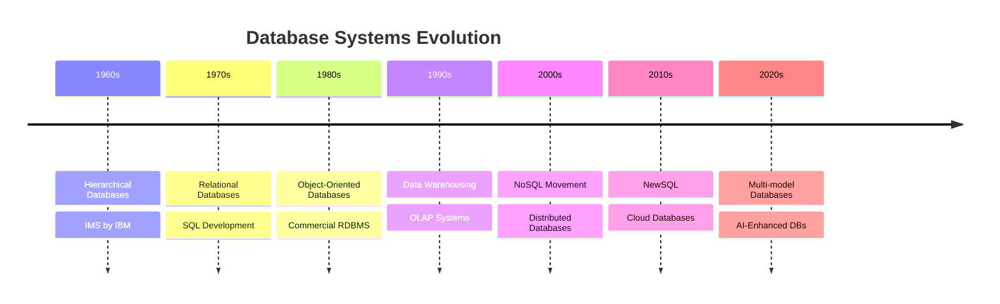
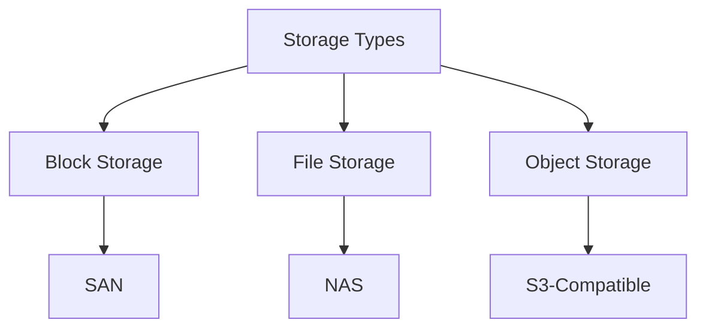
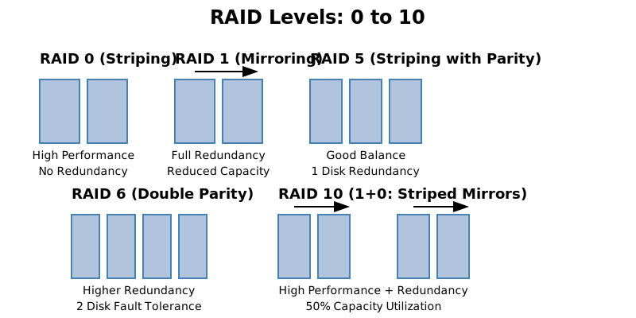

# I. Introduction to Database Systems
<!-- TOC -->
- [I. Introduction to Database Systems](#i-introduction-to-database-systems)
  - [Course Overview](#course-overview)
  - [Learning Objectives](#learning-objectives)
  - [1. Brief History of Database Systems](#1-brief-history-of-database-systems)
    - [1.1 Evolution Timeline](#11-evolution-timeline)
    - [1.2 Key Milestones](#12-key-milestones)
  - [2. Database Types Comparison](#2-database-types-comparison)
    - [2.1 Relational Databases](#21-relational-databases)
    - [2.2 NoSQL Databases](#22-nosql-databases)
    - [2.3 NewSQL](#23-newsql)
    - [2.4 Vector Databases](#24-vector-databases)
  - [3. Storage Types](#3-storage-types)
    - [3.1 Physical Storage](#31-physical-storage)
    - [3.2 Memory Hierarchy](#32-memory-hierarchy)
    - [3.3 Storage Considerations](#33-storage-considerations)
    - [3.4 RAID Types](#34-raid-types)
      - [Example: RAID 5](#example-raid-5)
  - [Conclusion](#conclusion)
<!-- /TOC -->

## Course Overview
This course provides a comprehensive understanding of database systems, their evolution, and modern architectural patterns. Students will learn both traditional ACID-compliant databases and modern distributed BASE systems.

## Learning Objectives
By the end of this course, students will be able to:
- Understand core database concepts and principles
- Compare different database types and their use cases
- Design efficient database schemas
- Make informed decisions between ACID and BASE approaches
- Implement basic to advanced database patterns

## 1. Brief History of Database Systems

### 1.1 Evolution Timeline

Figure 1.1: Database Systems Evolution

### 1.2 Key Milestones
- **1970**: Codd's Relational Model
- **1974**: SQL Development at IBM
- **1989**: First Commercial RDBMS
- **2009**: NoSQL term popularized
- **2012**: NewSQL emergence
- **2020+**: AI/ML integration in databases

## 2. Database Types Comparison

### 2.1 Relational Databases
- Strong consistency (ACID)
- Structured data
- SQL interface
- Examples: PostgreSQL, MySQL, Oracle

### 2.2 NoSQL Databases
- Document Stores (MongoDB, CouchDB)
- Key-Value Stores (Redis, DynamoDB)
- Column-Family (Cassandra, HBase)
- Graph Databases (Neo4j, ArangoDB)

### 2.3 NewSQL
- Combines ACID + horizontal scaling
- Examples: CockroachDB, Google Spanner

### 2.4 Vector Databases
- Specialized for AI and ML
- Examples: Milvus, Zilliz

## 3. Storage Types

### 3.1 Physical Storage

Figure 3.1: Storage Types

### 3.2 Memory Hierarchy
1. CPU Cache
2. Main Memory (RAM)
3. SSD/NVMe
4. HDD
5. Network Storage
6. Tape/Archive

### 3.3 Storage Considerations
- **Performance**: Access speed and latency
- **Durability**: Data persistence guarantees
- **Scalability**: Growth capabilities
- **Cost**: Price per GB/TB
- **Maintenance**: Backup and recovery options

### 3.4 RAID Types
- **RAID 0**: Striping, no redundancy, high performance.
- **RAID 1**: Mirroring, redundancy, fault tolerance.
- **RAID 5**: Striping with parity, balance of performance and redundancy.
- **RAID 6**: Striping with double parity, higher fault tolerance.
- **RAID 10**: Combination of RAID 1 and RAID 0, high performance and redundancy.

Figure 3.4: RAID Types

#### Example: RAID 5

Data Block 1:    1 1 0 1

Data Block 2:    0 1 1 0

Parity Block: ⊕  1 0 1 1

### Conclusion
In summary, understanding the various types of databases and storage solutions is crucial for designing efficient systems. Each database type offers unique advantages and trade-offs, making it essential to choose the right one based on specific application needs. As technology continues to evolve, staying informed about advancements in database systems will empower developers and organizations to make better data management decisions.

