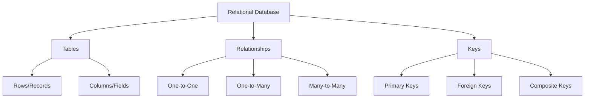
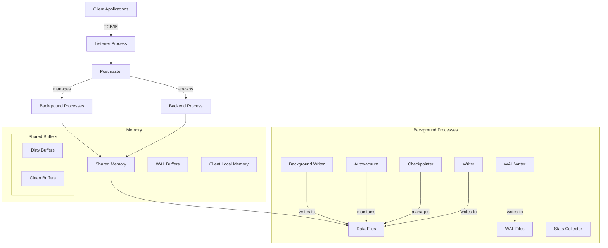
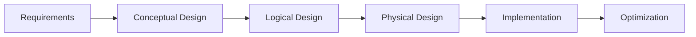
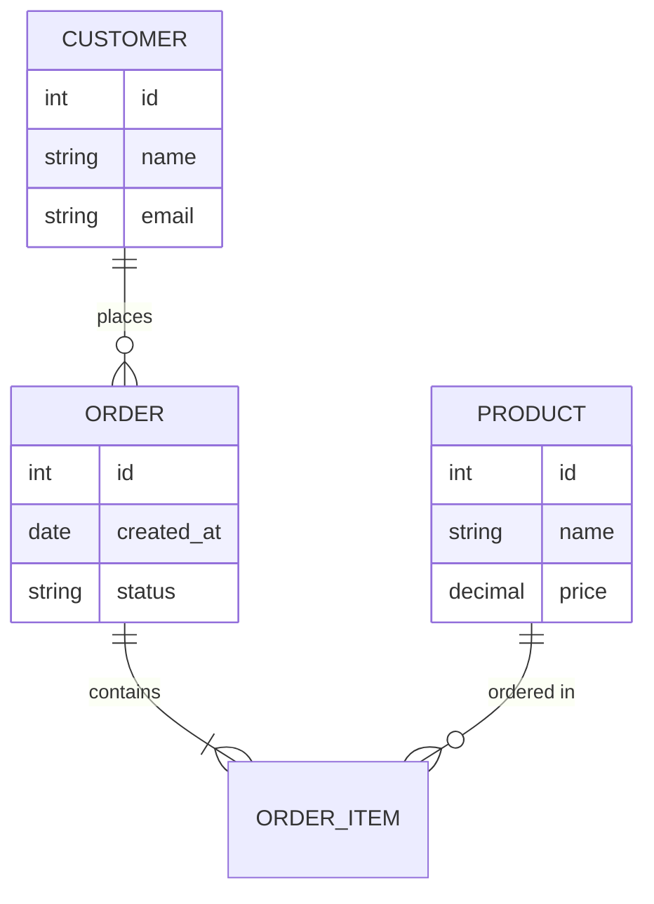

# II. Relational Databases

- [II. Relational Databases](#ii-relational-databases)
    - [1. Introduction to Relational Databases](#1-introduction-to-relational-databases)
        - [1.1 Core Concepts](#11-core-concepts)
        - [1.2 Benefits](#12-benefits)
    - [2. Database Architecture](#2-database-architecture)
        - [2.1 PostgreSQL Architecture](#21-postgresql-architecture)
            - [Core Components](#core-components)
        - [2.2 Comparison of Popular RDBMS](#22-comparison-of-popular-rdbms)
    - [3. SQL and Relational Model](#3-sql-and-relational-model)
        - [3.1 Basic SQL Operations](#31-basic-sql-operations)
    - [4. Database Schema Design](#4-database-schema-design)
        - [4.1 Design Process](#41-design-process)
        - [4.2 Entity Relationship Example](#42-entity-relationship-example)
    - [5. Data Types and Constraints](#5-data-types-and-constraints)
        - [5.1 Common Data Types](#51-common-data-types)
        - [5.2 Constraints Example](#52-constraints-example)
    - [6. Normalization and Data Integrity](#6-normalization-and-data-integrity)
        - [6.1 Normal Forms](#61-normal-forms)
        - [6.2 Normalization Example](#62-normalization-example)
        - [6.3 Data Integrity Rules](#63-data-integrity-rules)
    - [7. SQL Advanced Features](#7-sql-advanced-features)
        - [PostgreSQL Advanced Features Guide](#postgresql-advanced-features-guide)
            - [1. Indexes](#1-indexes)
            - [2. Transactions](#2-transactions)
            - [3. Views](#3-views)
            - [4. Stored Procedures](#4-stored-procedures)
            - [5. Triggers](#5-triggers)
            - [6. Window Functions](#6-window-functions)
            - [7. Common Table Expressions (CTEs)](#7-common-table-expressions-ctes)
            - [8. Recursive Queries](#8-recursive-queries)
            - [9. Materialized Views](#9-materialized-views)
            - [10. Pivot and Unpivot](#10-pivot-and-unpivot)
            - [11. JSON and JSONB](#11-json-and-jsonb)
            - [12. Full-Text Search](#12-full-text-search)
            - [13. Spatial Data (PostGIS)](#13-spatial-data-postgis)
    - [8. Best Practices](#8-best-practices)
        - [Best Practices](#best-practices)


## 1. Introduction to Relational Databases

### 1.1 Core Concepts

Figure 1.1: Core Concepts

### 1.2 Benefits
- Data Independence
- Data Integrity
- Complex Query Support
- Transaction Management
- Concurrent Access Control

## 2. Database Architecture

### 2.1 PostgreSQL Architecture



Figure 2.1: PostgreSQL Architecture

#### Core Components

1. **Process Structure**
   - Postmaster Process: Main PostgreSQL process
   - Backend Process: Handles client connections
   - Background Processes: Maintenance tasks

2. **Memory Architecture**
   - Shared Memory: Buffers and caches
   - Local Memory: Process-specific memory
   - Shared Buffers: Table and index cache
   - WAL Buffers: Transaction log cache

3. **Background Processes**
   - Writer: Handles data writes
   - WAL Writer: Manages transaction logs
   - Checkpointer: Ensures data consistency
   - Autovacuum: Cleanup and maintenance
   - Stats Collector: Database activity tracking

4. **Storage Architecture**
   - Data Files: Tables and indexes
   - WAL Files: Write-Ahead Logs
   - Configuration Files: Settings
   - Control File: Database state

5. **Client Connection Flow**
   - TCP/IP connection
   - Connection acceptance
   - Backend process creation
   - Query handling
   - Connection termination

6. **Transaction Management**
   - MVCC for concurrency
   - Write-Ahead Logging
   - Two-Phase Commit
   - Transaction isolation

### 2.2 Comparison of Popular RDBMS

| Feature | PostgreSQL | MySQL | MariaDB |
|---------|------------|-------|----------|
| License | Open Source | Dual License | Open Source |
| Extensions | Rich ecosystem | Limited | MySQL compatible |
| JSON Support | Native | Limited | Limited |
| Replication | Multi-master | Master-Slave | Multi-master |
| Performance | Complex queries | Simple queries | MySQL-like |

## 3. SQL and Relational Model

### 3.1 Basic SQL Operations
```sql
-- Create table
CREATE TABLE employees (
    id SERIAL PRIMARY KEY,
    name VARCHAR(100),
    department VARCHAR(50),
    salary DECIMAL(10,2)
);

-- Insert data
INSERT INTO employees (name, department, salary)
VALUES ('John Doe', 'Engineering', 75000);

-- Query with joins
SELECT e.name, d.department_name
FROM employees e
JOIN departments d ON e.department_id = d.id
WHERE e.salary > 50000;

-- Update with conditions
UPDATE employees 
SET salary = salary * 1.1
WHERE department = 'Engineering';

-- Delete with safeguard
DELETE FROM employees
WHERE id IN (
    SELECT id FROM employees
    WHERE department = 'Archived'
    LIMIT 100
);
```

## 4. Database Schema Design

### 4.1 Design Process

Figure 4.1: Database Schema Design Process

### 4.2 Entity Relationship Example


Figure 4.2: Entity Relationship Example
## 5. Data Types and Constraints

### 5.1 Common Data Types
- **Numeric**: INTEGER, DECIMAL, FLOAT
- **String**: VARCHAR, TEXT, CHAR
- **Date/Time**: DATE, TIMESTAMP, INTERVAL
- **Boolean**: BOOLEAN
- **Binary**: BLOB, BYTEA
- **JSON**: JSON, JSONB (PostgreSQL)

### 5.2 Constraints Example
```sql
CREATE TABLE products (
    id SERIAL PRIMARY KEY,
    name VARCHAR(100) NOT NULL,
    price DECIMAL(10,2) CHECK (price > 0),
    category_id INTEGER REFERENCES categories(id),
    created_at TIMESTAMP DEFAULT CURRENT_TIMESTAMP,
    UNIQUE (name, category_id)
);
```

## 6. Normalization and Data Integrity

### 6.1 Normal Forms
1. **First Normal Form (1NF)**
   - Atomic values
   - No repeating groups

2. **Second Normal Form (2NF)**
   - Meet 1NF
   - No partial dependencies

3. **Third Normal Form (3NF)**
   - Meet 2NF
   - No transitive dependencies

### 6.2 Normalization Example
```sql

create schema labs;
-- Before Normalization
CREATE TABLE labs.orders_unnormalized (
    order_id INT,
    customer_name VARCHAR(100),
    customer_email VARCHAR(100),
    product_name VARCHAR(100),
    product_price DECIMAL(10,2)
);

-- After Normalization
CREATE TABLE labs.customers (
    id SERIAL PRIMARY KEY,
    name VARCHAR(100),
    email VARCHAR(100) UNIQUE
);

CREATE TABLE labs.products (
    id SERIAL PRIMARY KEY,
    name VARCHAR(100),
    price DECIMAL(10,2)
);

CREATE TABLE labs.orders (
    id SERIAL PRIMARY KEY,
    customer_id INTEGER REFERENCES customers(id),
    created_at TIMESTAMP DEFAULT CURRENT_TIMESTAMP
);

CREATE TABLE labs.order_items (
    order_id INTEGER REFERENCES orders(id),
    product_id INTEGER REFERENCES products(id),
    quantity INTEGER,
    PRIMARY KEY (order_id, product_id)
);


```

### 6.3 Data Integrity Rules
- **Entity Integrity**: Primary key constraints
- **Referential Integrity**: Foreign key constraints
- **Domain Integrity**: Data type and check constraints
- **User-Defined Integrity**: Custom business rules

## 7. SQL Advanced Features

### PostgreSQL Advanced Features Guide

#### 1. Indexes

```sql
-- B-tree index (default)
CREATE INDEX idx_users_email ON users(email);

-- Partial index
CREATE INDEX idx_active_users ON users(user_id) WHERE status = 'active';

-- Multi-column index
CREATE INDEX idx_users_name ON users(last_name, first_name);

-- Unique index
CREATE UNIQUE INDEX idx_unique_email ON users(email);

-- GiST index (for geometric data)
CREATE INDEX idx_locations ON places USING GIST (coordinates);
```

#### 2. Transactions

```sql
-- Basic transaction
BEGIN;
UPDATE accounts SET balance = balance - 100 WHERE account_id = 1;
UPDATE accounts SET balance = balance + 100 WHERE account_id = 2;
COMMIT;

-- Transaction with savepoint
BEGIN;
UPDATE inventory SET quantity = quantity - 1 WHERE product_id = 101;
SAVEPOINT sp1;
UPDATE orders SET status = 'processing';
-- Something went wrong
ROLLBACK TO sp1;
COMMIT;
```

#### 3. Views

```sql
-- Simple view
CREATE VIEW active_users AS
SELECT * FROM users WHERE status = 'active';

-- View with joins
CREATE VIEW order_details AS
SELECT 
    o.order_id,
    c.customer_name,
    p.product_name,
    o.quantity,
    o.order_date
FROM orders o
JOIN customers c ON o.customer_id = c.customer_id
JOIN products p ON o.product_id = p.product_id;

-- Updatable view
CREATE VIEW high_value_products AS
SELECT * FROM products WHERE price > 1000
WITH CHECK OPTION;
```

#### 4. Stored Procedures

```sql
-- Basic stored procedure
CREATE OR REPLACE PROCEDURE update_user_status(
    user_id_param INT,
    new_status VARCHAR
)
LANGUAGE plpgsql
AS $$
BEGIN
    UPDATE users 
    SET status = new_status 
    WHERE user_id = user_id_param;
END;
$$;

-- Procedure with error handling
CREATE OR REPLACE PROCEDURE process_order(
    order_id_param INT
)
LANGUAGE plpgsql
AS $$
DECLARE
    v_stock INT;
    v_quantity INT;
BEGIN
    -- Get order quantity and current stock
    SELECT quantity INTO v_quantity FROM orders WHERE order_id = order_id_param;
    SELECT stock INTO v_stock FROM inventory WHERE product_id = 
        (SELECT product_id FROM orders WHERE order_id = order_id_param);
    
    IF v_stock >= v_quantity THEN
        -- Update inventory
        UPDATE inventory SET stock = stock - v_quantity 
        WHERE product_id = (SELECT product_id FROM orders WHERE order_id = order_id_param);
        -- Update order status
        UPDATE orders SET status = 'processed' WHERE order_id = order_id_param;
    ELSE
        RAISE EXCEPTION 'Insufficient stock';
    END IF;
EXCEPTION
    WHEN OTHERS THEN
        RAISE NOTICE 'Error processing order: %', SQLERRM;
END;
$$;
```

#### 5. Triggers

```sql
-- Audit trigger
CREATE TABLE audit_logs (
    id SERIAL PRIMARY KEY,
    table_name VARCHAR(50),
    operation VARCHAR(20),
    old_data JSONB,
    new_data JSONB,
    changed_at TIMESTAMP DEFAULT CURRENT_TIMESTAMP
);

CREATE OR REPLACE FUNCTION audit_trigger_func()
RETURNS TRIGGER AS $$
BEGIN
    IF TG_OP = 'INSERT' THEN
        INSERT INTO audit_logs (table_name, operation, new_data)
        VALUES (TG_TABLE_NAME, TG_OP, row_to_json(NEW));
    ELSIF TG_OP = 'UPDATE' THEN
        INSERT INTO audit_logs (table_name, operation, old_data, new_data)
        VALUES (TG_TABLE_NAME, TG_OP, row_to_json(OLD), row_to_json(NEW));
    ELSIF TG_OP = 'DELETE' THEN
        INSERT INTO audit_logs (table_name, operation, old_data)
        VALUES (TG_TABLE_NAME, TG_OP, row_to_json(OLD));
    END IF;
    RETURN NEW;
END;
$$ LANGUAGE plpgsql;

CREATE TRIGGER users_audit
AFTER INSERT OR UPDATE OR DELETE ON users
FOR EACH ROW EXECUTE FUNCTION audit_trigger_func();
```

#### 6. Window Functions

```sql
-- Row number within partition
SELECT 
    department,
    employee_name,
    salary,
    ROW_NUMBER() OVER (PARTITION BY department ORDER BY salary DESC) as salary_rank
FROM employees;

-- Running total
SELECT 
    order_date,
    amount,
    SUM(amount) OVER (ORDER BY order_date) as running_total
FROM orders;

-- Moving average
SELECT 
    date,
    price,
    AVG(price) OVER (ORDER BY date ROWS BETWEEN 6 PRECEDING AND CURRENT ROW) as moving_avg_7days
FROM stock_prices;
```

#### 7. Common Table Expressions (CTEs)

```sql
-- Basic CTE
WITH high_value_orders AS (
    SELECT customer_id, SUM(amount) as total_spent
    FROM orders
    GROUP BY customer_id
    HAVING SUM(amount) > 10000
)
SELECT 
    c.customer_name,
    h.total_spent
FROM high_value_orders h
JOIN customers c ON h.customer_id = c.customer_id;

-- Multiple CTEs
WITH monthly_sales AS (
    SELECT 
        DATE_TRUNC('month', order_date) as month,
        SUM(amount) as total_sales
    FROM orders
    GROUP BY DATE_TRUNC('month', order_date)
),
avg_sales AS (
    SELECT AVG(total_sales) as avg_monthly_sales
    FROM monthly_sales
)
SELECT 
    month,
    total_sales,
    ROUND(total_sales - avg_monthly_sales, 2) as difference_from_avg
FROM monthly_sales, avg_sales;
```

#### 8. Recursive Queries

```sql
-- Employee hierarchy
WITH RECURSIVE emp_hierarchy AS (
    -- Base case: top-level employees
    SELECT 
        employee_id,
        name,
        manager_id,
        1 as level,
        name::text as path
    FROM employees
    WHERE manager_id IS NULL
    
    UNION ALL
    
    -- Recursive case
    SELECT 
        e.employee_id,
        e.name,
        e.manager_id,
        h.level + 1,
        h.path || ' -> ' || e.name
    FROM employees e
    JOIN emp_hierarchy h ON e.manager_id = h.employee_id
)
SELECT * FROM emp_hierarchy ORDER BY path;

-- Category tree
WITH RECURSIVE category_tree AS (
    SELECT 
        category_id,
        name,
        parent_id,
        1 as level,
        name::text as path
    FROM categories
    WHERE parent_id IS NULL
    
    UNION ALL
    
    SELECT 
        c.category_id,
        c.name,
        c.parent_id,
        t.level + 1,
        t.path || ' -> ' || c.name
    FROM categories c
    JOIN category_tree t ON c.parent_id = t.category_id
)
SELECT * FROM category_tree ORDER BY path;
```

#### 9. Materialized Views

```sql
-- Create materialized view
CREATE MATERIALIZED VIEW monthly_sales_summary AS
SELECT 
    DATE_TRUNC('month', order_date) as month,
    product_id,
    SUM(quantity) as total_quantity,
    SUM(amount) as total_amount
FROM orders
GROUP BY DATE_TRUNC('month', order_date), product_id
WITH DATA;

-- Create index on materialized view
CREATE INDEX idx_monthly_sales_product 
ON monthly_sales_summary(product_id);

-- Refresh materialized view
REFRESH MATERIALIZED VIEW monthly_sales_summary;

-- Concurrent refresh
REFRESH MATERIALIZED VIEW CONCURRENTLY monthly_sales_summary;
```

#### 10. Pivot and Unpivot

```sql
-- Pivot (using crosstab function from tablefunc extension)
CREATE EXTENSION IF NOT EXISTS tablefunc;

Create table labs.orders
(   id SERIAL PRIMARY KEY,
    product_id INT REFERENCES labs.products(id),
    product_name VARCHAR,
    order_date DATE,
    amount NUMERIC
);

insert into labs.products (name, price)
values ('Product A', 100),
('Product B', 200),
('Product C', 300);

insert into labs.orders (product_id, product_name, order_date, amount)
values (1, 'Product A', '2021-01-01', 100),
(2, 'Product B', '2021-01-01', 200),
(3, 'Product C', '2021-01-01', 300);

// select * from labs.orders;
// select * from labs.products;

SELECT *
FROM crosstab(
    'SELECT 
        product_name,
        EXTRACT(YEAR FROM order_date) as year,
        SUM(amount) AS total_amount
     FROM labs.orders o
     JOIN labs.products p ON o.product_id = p.id
     GROUP BY product_name, EXTRACT(YEAR FROM order_date)
     ORDER BY product_name, year',
    'SELECT DISTINCT EXTRACT(YEAR FROM order_date)
     FROM labs.orders
     ORDER BY 1'
) AS final_result(
    product_name VARCHAR,
    "2021" NUMERIC,
    "2022" NUMERIC,
    "2023" NUMERIC
);


-- 1. First create the tablefunc extension if not exists
CREATE EXTENSION IF NOT EXISTS tablefunc;

drop table if exists labs.orders;
drop table if exists labs.products;
-- 2. Create the necessary tables and sample data
CREATE TABLE IF NOT EXISTS labs.orders (
    id SERIAL PRIMARY KEY,
    product_id INT,
    order_date DATE,
    amount NUMERIC
);

CREATE TABLE IF NOT EXISTS labs.products (
    id SERIAL PRIMARY KEY,
    name VARCHAR(100),
    price NUMERIC
);

-- 3. Insert sample data across multiple years
INSERT INTO labs.products (id, name, price) VALUES 
    (1, 'Product A', 100),
    (2, 'Product B', 200),
    (3, 'Product C', 300);

INSERT INTO labs.orders (product_id, order_date, amount) VALUES 
    -- 2021 data
    (1, '2021-01-15', 150),
    (2, '2021-02-20', 250),
    (3, '2021-03-25', 350),
    -- 2022 data
    (1, '2022-01-10', 160),
    (2, '2022-02-15', 260),
    (3, '2022-03-20', 360),
    -- 2023 data
    (1, '2023-01-05', 170),
    (2, '2023-02-10', 270),
    (3, '2023-03-15', 370);

-- 4. Create the crosstab query
SELECT *
FROM crosstab(
    $$
    SELECT 
        p.name as product_name,
        EXTRACT(YEAR FROM o.order_date)::text as year,
        SUM(o.amount) as total_amount
    FROM labs.orders o
    JOIN labs.products p ON o.product_id = p.id
    GROUP BY p.name, EXTRACT(YEAR FROM o.order_date)
    ORDER BY p.name, EXTRACT(YEAR FROM o.order_date)
    $$,
    $$
    SELECT DISTINCT EXTRACT(YEAR FROM order_date)::text
    FROM labs.orders
    ORDER BY 1
    $$
) AS final_result(
    product_name VARCHAR,
    "2021" NUMERIC,
    "2022" NUMERIC,
    "2023" NUMERIC
);

CREATE TABLE IF NOT EXISTS labs.inventory (
    product_id INT,
    quantity INT,
    reorder_point INT,
    last_count_date DATE
);

-- Insert sample data
INSERT INTO labs.inventory (product_id, quantity, reorder_point, last_count_date) VALUES 
    (1, 100, 20, '2024-01-15'),
    (2, 150, 30, '2024-01-15'),
    (3, 75, 25, '2024-01-15');

-- UNPIVOT query
SELECT 
    product_id,
    metric,
    value
FROM (
    SELECT 
        product_id,
        quantity,
        reorder_point
    FROM labs.inventory
) p
CROSS JOIN LATERAL (
    VALUES 
        ('quantity', quantity::numeric),
        ('reorder_point', reorder_point::numeric)
) AS unpivoted(metric, value);

-- Alternative using UNION ALL
SELECT 
    product_id,
    'quantity' as metric,
    quantity::numeric as value
FROM labs.inventory
UNION ALL
SELECT 
    product_id,
    'reorder_point' as metric,
    reorder_point::numeric as value
FROM labs.inventory
ORDER BY product_id, metric;
```

#### 11. JSON and JSONB

```sql
-- Create table with JSONB
CREATE TABLE user_profiles (
    user_id INT PRIMARY KEY,
    profile JSONB
);

-- Insert JSON data
INSERT INTO user_profiles (user_id, profile) VALUES
(1, '{"name": "John", "age": 30, "interests": ["reading", "hiking"]}');

-- Query JSON data
SELECT 
    user_id,
    profile->>'name' as name,
    profile->>'age' as age,
    profile->'interests' as interests
FROM user_profiles;

-- Update JSON data
UPDATE user_profiles
SET profile = profile || '{"city": "New York"}'::jsonb
WHERE user_id = 1;

-- Query array elements
SELECT user_id
FROM user_profiles
WHERE profile->'interests' ? 'hiking';

-- JSON containment
SELECT *
FROM user_profiles
WHERE profile @> '{"age": 30}'::jsonb;
```

#### 12. Full-Text Search

```sql
-- Create text search vectors
ALTER TABLE products ADD COLUMN ts_vector tsvector;
UPDATE products SET ts_vector = 
    setweight(to_tsvector('english', title), 'A') ||
    setweight(to_tsvector('english', description), 'B');

-- Create GiST index
CREATE INDEX idx_products_ts ON products USING GiST (ts_vector);

-- Search query
SELECT title, description
FROM products
WHERE ts_vector @@ to_tsquery('english', 'laptop & wireless');

-- Rank search results
SELECT 
    title,
    description,
    ts_rank(ts_vector, query) as rank
FROM products, to_tsquery('english', 'laptop & wireless') query
WHERE ts_vector @@ query
ORDER BY rank DESC;
```

#### 13. Spatial Data (PostGIS)
select version();
```sql
-- Enable PostGIS
-- CREATE EXTENSION postgis;
CREATE EXTENSION IF NOT EXISTS postgis;
CREATE EXTENSION IF NOT EXISTS postgis_topology;
CREATE EXTENSION IF NOT EXISTS fuzzystrmatch;
CREATE EXTENSION IF NOT EXISTS postgis_tiger_geocoder;
CREATE EXTENSION IF NOT EXISTS tablefunc;

-- Create spatial table
CREATE TABLE locations (
    id SERIAL PRIMARY KEY,
    name VARCHAR(100),
    location GEOMETRY(Point, 4326)
);

-- Insert point
INSERT INTO locations (name, location) VALUES
('Central Park', ST_SetSRID(ST_MakePoint(-73.965355, 40.782865), 4326));
INSERT INTO locations (name, location) VALUES
('Times Square', ST_SetSRID(ST_MakePoint(-73.98513, 40.75868), 4326));
INSERT INTO locations (name, location) VALUES
('Empire State Building', ST_SetSRID(ST_MakePoint(-73.985656, 40.748437), 4326));

-- Find locations within distance
SELECT name
FROM locations
WHERE ST_DWithin(
    location::geography,
    ST_SetSRID(ST_MakePoint(-73.98, 40.75), 4326)::geography,
    5000  -- 5km radius
);

-- Calculate distance
SELECT 
    a.name as location1,
    b.name as location2,
    ST_Distance(
        a.location::geography,
        b.location::geography
    ) as distance_meters
FROM locations a
CROSS JOIN locations b
WHERE a.id < b.id;
```

Each of these examples demonstrates key PostgreSQL features that you can adapt and build upon for your specific needs. Would you like me to elaborate on any particular feature or provide more complex examples?
## 8. Best Practices

### Best Practices
1. Use appropriate data types
2. Implement proper constraints
3. Follow naming conventions
4. Document schema changes
5. Plan for scalability
6. Regular performance monitoring
7. Backup and recovery strategy
