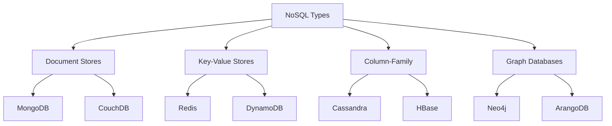
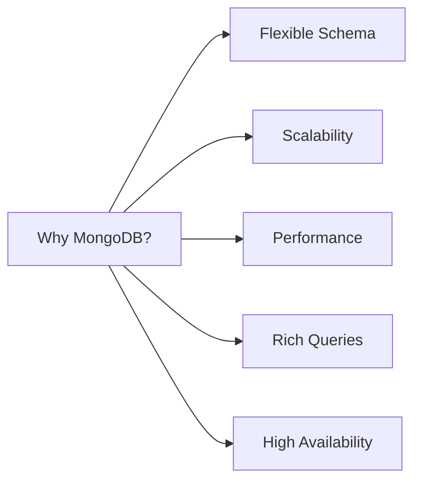

# III. NoSQL Databases
<!-- TOC -->
- [III. NoSQL Databases](#iii-nosql-databases)
  - [1. Introduction to NoSQL Databases](#1-introduction-to-nosql-databases)
    - [1.1 Key Characteristics](#11-key-characteristics)
    - [1.2 Types of NoSQL Databases](#12-types-of-nosql-databases)
<!-- /TOC -->
## 1. Introduction to NoSQL Databases

### 1.1 Key Characteristics
- **Schema-less**: No predefined schema, allowing for flexible data models.
- **Horizontal Scalability**: Can easily scale out to handle large amounts of data.
- **High Availability**: Designed for fault tolerance and high availability.
- **Distributed Data**: Data is distributed across multiple nodes.
- **CAP Theorem**: Emphasizes either Consistency, Availability, or Partition Tolerance.

### 1.2 Types of NoSQL Databases


## 2. MongoDB

### 2.1 Introduction

#### 2.1.1 What is MongoDB?
MongoDB is a document-oriented NoSQL database that stores data in flexible, JSON-like documents. It provides:
- Document-oriented storage
- High performance
- High availability
- Easy scalability
- Rich query language

#### 2.1.2 Why MongoDB?


#### 2.1.3 MongoDB vs. SQL

| Feature | MongoDB | SQL |
|---------|---------|-----|
| Data Model | Document-based | Table-based |
| Schema | Flexible | Fixed |
| Relationships | Embedded & References | Foreign Keys |
| Transactions | ACID in 4.0+ | ACID |
| Scaling | Horizontal | Vertical |
| Query Language | JSON-like | SQL |

### 2.2 Data Model

#### 2.2.1 Collections and Documents
```javascript
// Example of a MongoDB document
{
  _id: ObjectId("5f7d3b2e1c9d440000f1c2d3"),
  title: "MongoDB Basics",
  author: {
    name: "John Doe",
    email: "john@example.com"
  },
  tags: ["database", "nosql", "mongodb"],
  comments: [
    {
      user: "Alice",
      text: "Great article!",
      date: ISODate("2023-01-15")
    }
  ]
}
```

### 2.3 CRUD Operations

#### 2.3.1 Create Operations
```javascript
// Insert one document
db.articles.insertOne({
    title: "Getting Started with MongoDB",
    author: "John Doe",
    date: new Date(),
    tags: ["mongodb", "database"]
});

// Insert multiple documents
db.articles.insertMany([
    {
        title: "MongoDB Indexing",
        author: "Jane Smith",
        date: new Date()
    },
    {
        title: "MongoDB Aggregation",
        author: "Bob Wilson",
        date: new Date()
    }
]);
```

#### 2.3.2 Read Operations
```javascript
// Find all documents
db.articles.find();

// Find with conditions
db.articles.find({
    author: "John Doe",
    tags: "mongodb"
});

// Projection
db.articles.find(
    { author: "John Doe" },
    { title: 1, date: 1, _id: 0 }
);

// Complex queries
db.articles.find({
    date: { 
        $gte: ISODate("2023-01-01"),
        $lt: ISODate("2024-01-01")
    },
    tags: { $in: ["mongodb", "database"] }
});
```

#### 2.3.3 Update Operations
```javascript
// Update one document
db.articles.updateOne(
    { title: "MongoDB Basics" },
    {
        $set: {
            lastModified: new Date(),
            status: "published"
        },
        $push: {
            tags: "tutorial"
        }
    }
);

// Update many documents
db.articles.updateMany(
    { author: "John Doe" },
    {
        $set: { reviewed: true }
    }
);
```

#### 2.3.4 Delete Operations
```javascript
// Delete one document
db.articles.deleteOne({
    title: "MongoDB Basics"
});

// Delete many documents
db.articles.deleteMany({
    date: { $lt: ISODate("2023-01-01") }
});
```

### 2.4 Aggregation Framework

```javascript
// Complex aggregation pipeline
db.orders.aggregate([
    // Stage 1: Match orders from 2023
    {
        $match: {
            orderDate: {
                $gte: ISODate("2023-01-01"),
                $lt: ISODate("2024-01-01")
            }
        }
    },
    // Stage 2: Group by customer
    {
        $group: {
            _id: "$customerId",
            totalOrders: { $sum: 1 },
            totalAmount: { $sum: "$amount" },
            averageOrderValue: { $avg: "$amount" }
        }
    },
    // Stage 3: Sort by total amount
    {
        $sort: { totalAmount: -1 }
    },
    // Stage 4: Limit to top 10
    {
        $limit: 10
    }
]);
```

### 2.5 Indexing

```javascript
// Create single field index
db.articles.createIndex({ title: 1 });

// Create compound index
db.articles.createIndex({ 
    author: 1, 
    date: -1 
});

// Create text index
db.articles.createIndex({
    title: "text",
    content: "text"
});

// Create geospatial index
db.locations.createIndex({
    coordinates: "2dsphere"
});
```

### 2.6 Transactions

```javascript
// Start a session
const session = db.getMongo().startSession();

// Start transaction
session.startTransaction();

try {
    // Perform operations
    const orders = session.getDatabase("mydb").orders;
    const inventory = session.getDatabase("mydb").inventory;
    
    // Insert order
    orders.insertOne({
        item: "xyz",
        qty: 1,
        price: 100
    }, { session });
    
    // Update inventory
    inventory.updateOne(
        { item: "xyz" },
        { $inc: { qty: -1 } },
        { session }
    );
    
    // Commit the transaction
    session.commitTransaction();
} catch (error) {
    // Abort transaction on error
    session.abortTransaction();
    throw error;
} finally {
    session.endSession();
}
```

### 2.7 Data Modeling Patterns

#### 2.7.1 Embedded Documents Pattern
```javascript
// Product catalog with variants
{
    _id: ObjectId("..."),
    name: "T-Shirt",
    brand: "Example Brand",
    variants: [
        {
            sku: "TS-RED-L",
            color: "Red",
            size: "L",
            price: 29.99,
            inventory: 100
        },
        {
            sku: "TS-BLUE-M",
            color: "Blue",
            size: "M",
            price: 29.99,
            inventory: 85
        }
    ]
}
```

#### 2.7.2 References Pattern
```javascript
// Author document
{
    _id: ObjectId("author123"),
    name: "John Doe",
    email: "john@example.com"
}

// Book document with author reference
{
    _id: ObjectId("book123"),
    title: "MongoDB Guide",
    authorId: ObjectId("author123"),
    published: ISODate("2023-01-15")
}
```

### 2.8 Best Practices

1. **Schema Design**
   - Design for how data is accessed
   - Consider embedding vs referencing
   - Plan for data growth

2. **Indexing**
   - Create indexes for frequent queries
   - Avoid over-indexing
   - Monitor index usage

3. **Performance**
   - Use appropriate write concern
   - Batch operations when possible
   - Monitor and optimize queries

4. **Security**
   - Enable authentication
   - Use role-based access control
   - Encrypt sensitive data

