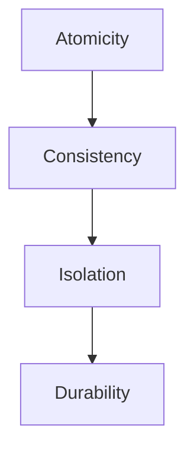
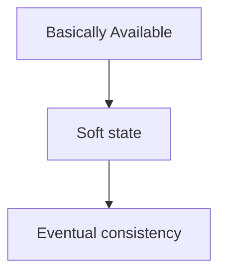
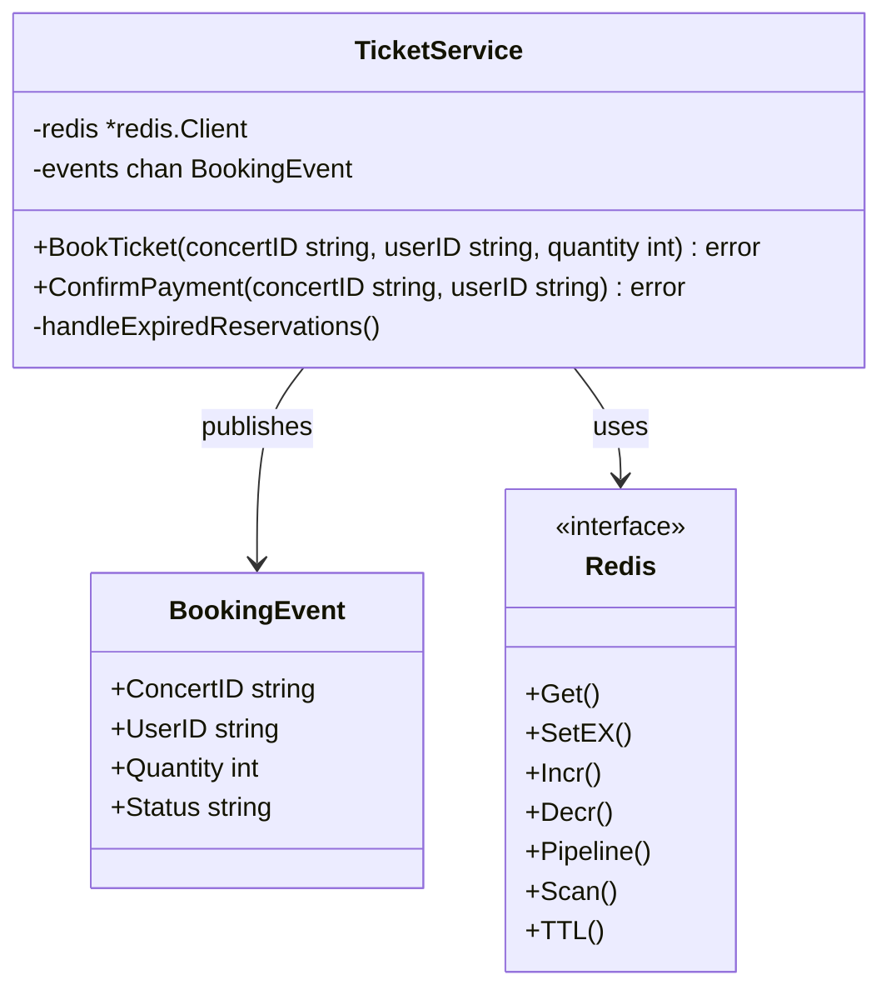

# IV. ACID vs. BASE

<!-- TOC -->
- [IV. ACID vs. BASE](#iv-acid-vs-base)
  - [1. ACID Properties](#1-acid-properties)
    - [Atomicity](#atomicity)
    - [Consistency](#consistency)
    - [Isolation](#isolation)
    - [Durability](#durability)
    - [ACID Example: Bank Transfer](#acid-example-bank-transfer)
  - [2. BASE Properties](#2-base-properties)
    - [Basically Available](#basically-available)
    - [Soft State](#soft-state)
    - [Eventual Consistency](#eventual-consistency)
    - [BASE Example: Concert Ticket System](#base-example-concert-ticket-system)
  - [When to Use ACID vs BASE](#when-to-use-acid-vs-base)
  - [Key Differences](#key-differences)
<!-- TOC End -->

## 1. ACID Properties
ACID properties are a set of guarantees that traditional database management systems (like PostgreSQL, MySQL) provide for transaction processing.


Figure 4.1: ACID Properties

### Atomicity
- All operations in a transaction succeed or all fail
- No partial completion
- Example: Bank transfer must either complete fully or not at all

### Consistency
- Data remains in a valid state before and after transaction
- All database rules, constraints, and triggers are enforced

### Isolation
- Concurrent transactions don't interfere with each other
- Transactions appear to run sequentially

### Durability
- Once committed, data remains permanent
- Survives system crashes, power failures

**ACID Example: Bank Transfer**
```sql
-- ACID Transaction Example
BEGIN;
    -- Deduct from account A
    UPDATE accounts 
    SET balance = balance - 100 
    WHERE account_id = 'A';
    
    -- Add to account B
    UPDATE accounts 
    SET balance = balance + 100 
    WHERE account_id = 'B';
COMMIT;
```

## 2. BASE Properties
BASE is an alternative to ACID, optimized for scalability and performance in distributed systems.



### Basically Available
- System guarantees availability
- Partial failures are allowed
- System continues to function even with some nodes down

### Soft State
- System state may change over time
- Updates may not be instantly consistent
- Temporary inconsistency is acceptable

### Eventual Consistency
- System will become consistent over time
- All replicas will eventually have the same data
- No guarantee of immediate consistency

**BASE Example: Concert Ticket System**



```go
type TicketService struct {
    redis  *redis.Client
    events chan BookingEvent
}

type BookingEvent struct {
    ConcertID string
    UserID    string
    Quantity  int
    Status    string // "reserved", "sold", "expired"
}

const (
    ReservationTTL = 10 * time.Minute
)

func (s *TicketService) BookTicket(concertID, userID string, quantity int) error {
    // Check available tickets
    availableKey := fmt.Sprintf("concert:%s:available", concertID)
    reservedKey := fmt.Sprintf("concert:%s:reserved", concertID)
    
    // Get available tickets atomically
    available, err := s.redis.Get(context.Background(), availableKey).Int()
    if err != nil {
        return fmt.Errorf("failed to get available tickets: %w", err)
    }
    
    if available < quantity {
        return fmt.Errorf("not enough tickets available")
    }
    
    // Set reservation with TTL
    reservationKey := fmt.Sprintf("concert:%s:reservation:%s", concertID, userID)
    err = s.redis.SetEX(
        context.Background(),
        reservationKey,
        quantity,
        ReservationTTL,
    ).Err()
    if err != nil {
        return fmt.Errorf("failed to reserve tickets: %w", err)
    }
    
    // Decrease available count
    s.redis.Decr(context.Background(), availableKey)
    
    // Increment reserved count
    s.redis.Incr(context.Background(), reservedKey)
    
    // Publish event for monitoring
    s.events <- BookingEvent{
        ConcertID: concertID,
        UserID:    userID,
        Quantity:  quantity,
        Status:    "reserved",
    }
    
    return nil
}

func (s *TicketService) ConfirmPayment(concertID, userID string) error {
    reservationKey := fmt.Sprintf("concert:%s:reservation:%s", concertID, userID)
    reservedKey := fmt.Sprintf("concert:%s:reserved", concertID)
    soldKey := fmt.Sprintf("concert:%s:sold", concertID)
    
    // Check if reservation exists and is still valid
    quantity, err := s.redis.Get(context.Background(), reservationKey).Int()
    if err != nil {
        return fmt.Errorf("reservation not found or expired: %w", err)
    }
    
    // Update status to sold
    pipe := s.redis.Pipeline()
    pipe.Del(context.Background(), reservationKey)
    pipe.Decr(context.Background(), reservedKey)
    pipe.Incr(context.Background(), soldKey)
    
    _, err = pipe.Exec(context.Background())
    if err != nil {
        return fmt.Errorf("failed to confirm payment: %w", err)
    }
    
    // Publish sold event
    s.events <- BookingEvent{
        ConcertID: concertID,
        UserID:    userID,
        Quantity:  quantity,
        Status:    "sold",
    }
    
    return nil
}

// Background worker for handling expired reservations
func (s *TicketService) handleExpiredReservations() {
    for {
        // Scan for expired reservations
        pattern := "concert:*:reservation:*"
        iter := s.redis.Scan(context.Background(), 0, pattern, 0).Iterator()
        
        for iter.Next(context.Background()) {
            key := iter.Val()
            // If TTL expired, return tickets to available pool
            if s.redis.TTL(context.Background(), key).Val() <= 0 {
                parts := strings.Split(key, ":")
                concertID, userID := parts[1], parts[3]
                
                quantity, _ := s.redis.Get(context.Background(), key).Int()
                
                pipe := s.redis.Pipeline()
                pipe.Del(context.Background(), key)
                pipe.Incr(context.Background(), fmt.Sprintf("concert:%s:available", concertID))
                pipe.Decr(context.Background(), fmt.Sprintf("concert:%s:reserved", concertID))
                pipe.Exec(context.Background())
                
                s.events <- BookingEvent{
                    ConcertID: concertID,
                    UserID:    userID,
                    Quantity:  quantity,
                    Status:    "expired",
                }
            }
        }
        time.Sleep(time.Minute)
    }
}
```

### When to Use ACID vs BASE

**Choose ACID when:**
- Financial transactions
- Legal requirements
- Strong consistency needs
- Data accuracy is critical

**Choose BASE when:**
- High scalability needed
- High availability required
- Temporary inconsistency acceptable
- Social media posts, logs, analytics

## Key Differences

| Feature | ACID | BASE |
|---------|------|------|
| Consistency | Immediate | Eventual |
| Availability | May reduce for consistency | Prioritized |
| Partition Tolerance | Limited | High |
| Use Cases | Banking, ERP | Social Media, Big Data |
| Complexity | Higher | Lower |
| Scale | Vertical | Horizontal |
