# V. Database Modeling
<!-- TOC -->
- [V. Database Modeling](#v-database-modeling)
    - [1. Business Objectives](#1-business-objectives)
    - [2. Business Context](#2-business-context)
        - [2.1 Domain Analysis](#21-domain-analysis)
        - [2.2 Requirements Gathering](#22-requirements-gathering)
    - [3. Data Model](#3-data-model)
        - [3.1 Conceptual Model](#31-conceptual-model)
        - [3.2 Logical Model](#32-logical-model)
        - [3.3 Physical Model](#33-physical-model)
    - [4. Data Types](#4-data-types)
        - [4.1 Common Data Types](#41-common-data-types)
        - [4.2 Custom Data Types](#42-custom-data-types)
    - [5. Data Relationships](#5-data-relationships)
        - [5.1 Types of Relationships](#51-types-of-relationships)
        - [5.2 Implementation Examples](#52-implementation-examples)
    - [6. Data Modeling Techniques](#6-data-modeling-techniques)
        - [6.1 Normalization](#61-normalization)
            - [First Normal Form (1NF)](#first-normal-form-1nf)
            - [Second Normal Form (2NF)](#second-normal-form-2nf)
            - [Third Normal Form (3NF)](#third-normal-form-3nf)
            - [Boyce-Codd Normal Form (BCNF)](#boyce-codd-normal-form-bcnf)
        - [6.2 Denormalization](#62-denormalization)
        - [6.3 Dimensional Modeling](#63-dimensional-modeling)
    - [7. Data Governance](#7-data-governance)
        - [7.1 Data Quality](#71-data-quality)
        - [7.2 Data Dictionary](#72-data-dictionary)
    - [8. Policy](#8-policy)
        - [8.1 Naming Conventions](#81-naming-conventions)
        - [8.2 Documentation Requirements](#82-documentation-requirements)
    - [9. Security](#9-security)
        - [9.1 Access Control](#91-access-control)
        - [9.2 Data Protection](#92-data-protection)
        - [9.3 Compliance](#93-compliance)
    - [10. Best Practices](#10-best-practices)
    - [11. Common Pitfalls](#11-common-pitfalls)
    - [12. Incremental Design for Support Multiple Versions](#12-incremental-design-for-support-multiple-versions)
<!-- /TOC -->
## 1. Business Objectives
```mermaid
graph TD
    A[Business Objectives] --> Revenue
    A --> Cost Reduction
    A --> Customer Satisfaction
```

Figure 1.1: Business Objectives

## 2. Business Context
### 2.1 Domain Analysis
- Understanding the business domain
- Identifying core entities and processes
- Capturing business rules and constraints

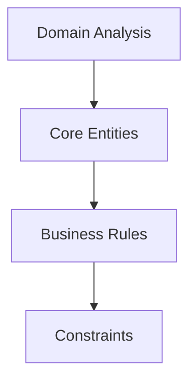

Figure 2.1: Domain Analysis


### 2.2 Requirements Gathering
- Functional requirements
- Non-functional requirements
- Performance requirements
- Scalability needs

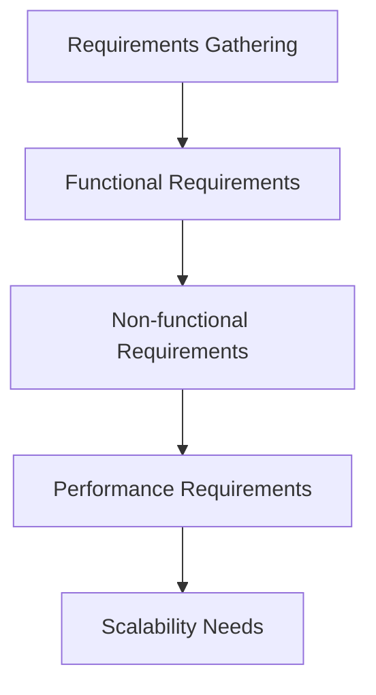

Figure 2.2: Requirements Gathering

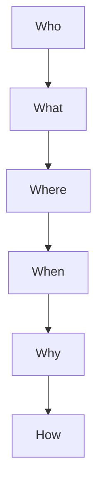

Figure 2.3: 5W1H

## 3. Data Model
### 3.1 Conceptual Model
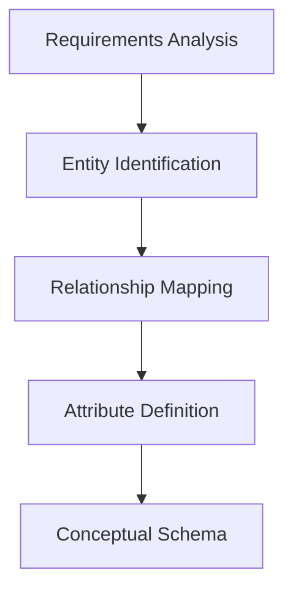

Figure 3.1: Conceptual Model

### 3.2 Logical Model
- Entity-Relationship Diagrams (ERD)
- Normalization
- Denormalization decisions
- Key definitions

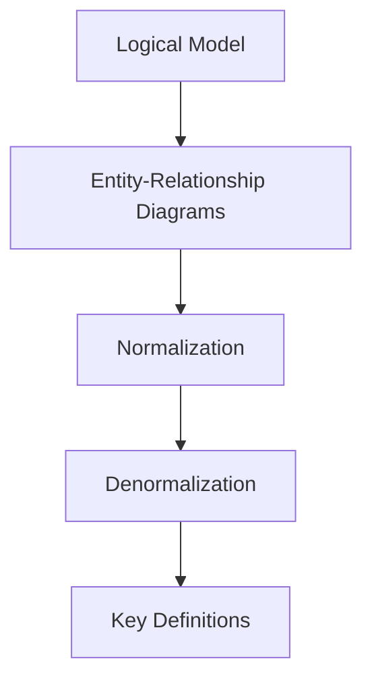

Figure 3.2: Logical Model

### 3.3 Physical Model
- Table structures
- Indexes
- Partitioning
- Storage considerations

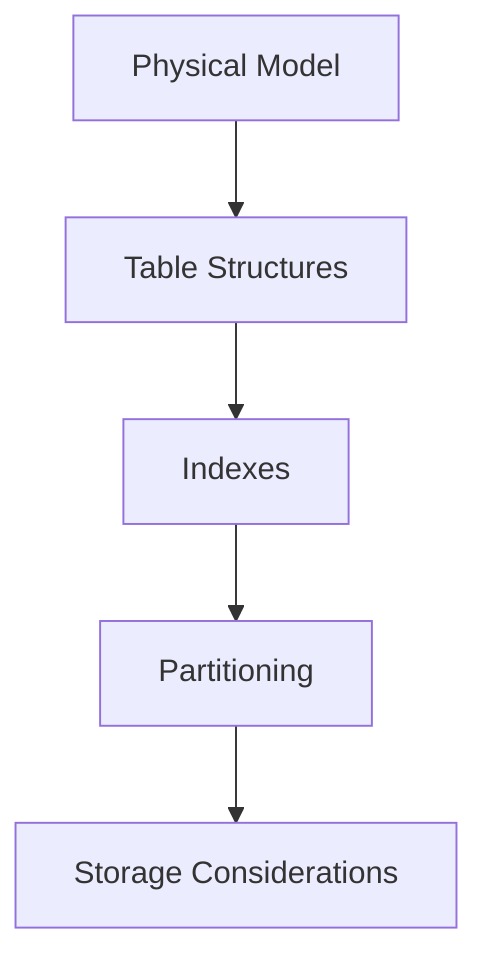

Figure 3.3: Physical Model

## 4. Data Types
### 4.1 Common Data Types
- Numeric types
- Character types
- Date/Time types
- Binary types
- JSON/XML types

### 4.2 Custom Data Types
```sql
-- Example of custom type
CREATE TYPE address AS (
    street VARCHAR(100),
    city VARCHAR(50),
    state CHAR(2),
    zip VARCHAR(10)
);
```

## 5. Data Relationships
### 5.1 Types of Relationships
- One-to-One
- One-to-Many
- Many-to-Many

### 5.2 Implementation Examples
```sql
-- One-to-Many Example
CREATE TABLE orders (
    order_id SERIAL PRIMARY KEY,
    customer_id INTEGER REFERENCES customers(id),
    order_date TIMESTAMP
);

-- Many-to-Many Example
CREATE TABLE product_categories (
    product_id INTEGER REFERENCES products(id),
    category_id INTEGER REFERENCES categories(id),
    PRIMARY KEY (product_id, category_id)
);
```

Figure 5.1: Data Relationships

## 6. Data Modeling Techniques
### 6.1 Normalization
#### First Normal Form (1NF)
- Eliminate repeating groups
- Create separate tables for each set of related data
- Identify each record with a primary key

**Before 1NF:**
```sql
CREATE TABLE student_courses (
    student_id INT,
    student_name VARCHAR(100),
    courses VARCHAR(200)  -- Contains "Math, Physics, Chemistry"
);
```

**After 1NF:**
```sql
CREATE TABLE students (
    student_id INT PRIMARY KEY,
    student_name VARCHAR(100)
);

CREATE TABLE student_courses (
    student_id INT,
    course_name VARCHAR(50),
    PRIMARY KEY (student_id, course_name),
    FOREIGN KEY (student_id) REFERENCES students(student_id)
);
```

#### Second Normal Form (2NF)
- Must be in 1NF
- Remove partial dependencies

**Before 2NF:**
```sql
CREATE TABLE order_items (
    order_id INT,
    product_id INT,
    product_name VARCHAR(100),
    product_category VARCHAR(50),
    quantity INT,
    PRIMARY KEY (order_id, product_id)
);
```

**After 2NF:**
```sql
CREATE TABLE products (
    product_id INT PRIMARY KEY,
    product_name VARCHAR(100),
    product_category VARCHAR(50)
);

CREATE TABLE order_items (
    order_id INT,
    product_id INT,
    quantity INT,
    PRIMARY KEY (order_id, product_id),
    FOREIGN KEY (product_id) REFERENCES products(product_id)
);
```

#### Third Normal Form (3NF)
- Must be in 2NF
- Remove transitive dependencies

**Before 3NF:**
```sql
CREATE TABLE employees (
    employee_id INT PRIMARY KEY,
    employee_name VARCHAR(100),
    department_id INT,
    department_name VARCHAR(50),
    department_budget DECIMAL(10,2)
);
```

**After 3NF:**
```sql
CREATE TABLE departments (
    department_id INT PRIMARY KEY,
    department_name VARCHAR(50),
    department_budget DECIMAL(10,2)
);

CREATE TABLE employees (
    employee_id INT PRIMARY KEY,
    employee_name VARCHAR(100),
    department_id INT,
    FOREIGN KEY (department_id) REFERENCES departments(department_id)
);
```

#### Boyce-Codd Normal Form (BCNF)
- Must be in 3NF
- For any dependency A → B, A should be a super key

**Before BCNF:**
```sql
CREATE TABLE course_teachers (
    student_id INT,
    subject VARCHAR(50),
    teacher_id INT,
    PRIMARY KEY (student_id, subject),
    -- Assuming each subject can only be taught by one teacher
    UNIQUE (subject, teacher_id)
);
```

**After BCNF:**
```sql
CREATE TABLE subject_teachers (
    subject VARCHAR(50) PRIMARY KEY,
    teacher_id INT
);

CREATE TABLE student_subjects (
    student_id INT,
    subject VARCHAR(50),
    PRIMARY KEY (student_id, subject),
    FOREIGN KEY (subject) REFERENCES subject_teachers(subject)
);
```

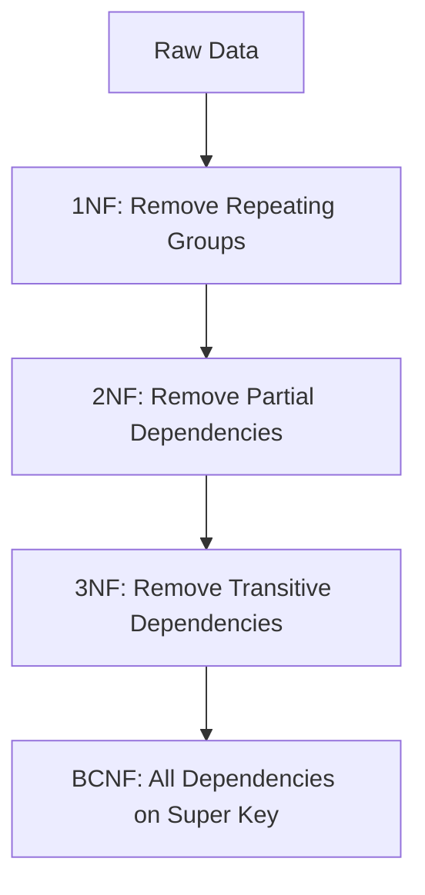

Figure 6.1: Normalization Process

### 6.2 Denormalization
- Performance optimization
- Read vs. Write trade-offs
- Redundancy management

#### Example 1: Redundant Data for Read Performance
**Normalized Tables:**
```sql
CREATE TABLE orders (
    order_id INT PRIMARY KEY,
    customer_id INT,
    order_date TIMESTAMP,
    FOREIGN KEY (customer_id) REFERENCES customers(customer_id)
);

CREATE TABLE order_items (
    order_id INT,
    product_id INT,
    quantity INT,
    price DECIMAL(10,2),
    PRIMARY KEY (order_id, product_id),
    FOREIGN KEY (order_id) REFERENCES orders(order_id),
    FOREIGN KEY (product_id) REFERENCES products(product_id)
);
```

**Denormalized for Order Summary:**
```sql
CREATE TABLE orders (
    order_id INT PRIMARY KEY,
    customer_id INT,
    order_date TIMESTAMP,
    total_amount DECIMAL(10,2),    -- Redundant calculated field
    total_items INT,               -- Redundant count
    last_modified TIMESTAMP,
    FOREIGN KEY (customer_id) REFERENCES customers(customer_id)
);

-- Trigger to maintain denormalized fields
CREATE OR REPLACE FUNCTION update_order_summary()
RETURNS TRIGGER AS $$
BEGIN
    UPDATE orders
    SET total_amount = (
        SELECT SUM(quantity * price)
        FROM order_items
        WHERE order_id = NEW.order_id
    ),
    total_items = (
        SELECT SUM(quantity)
        FROM order_items
        WHERE order_id = NEW.order_id
    ),
    last_modified = CURRENT_TIMESTAMP
    WHERE order_id = NEW.order_id;
    RETURN NEW;
END;
$$ LANGUAGE plpgsql;

CREATE TRIGGER order_summary_update
AFTER INSERT OR UPDATE OR DELETE ON order_items
FOR EACH ROW EXECUTE FUNCTION update_order_summary();
```

#### Example 2: Flattening Hierarchical Data
**Normalized Tables:**
```sql
CREATE TABLE categories (
    category_id INT PRIMARY KEY,
    name VARCHAR(100),
    parent_id INT,
    FOREIGN KEY (parent_id) REFERENCES categories(category_id)
);

CREATE TABLE products (
    product_id INT PRIMARY KEY,
    name VARCHAR(100),
    category_id INT,
    FOREIGN KEY (category_id) REFERENCES categories(category_id)
);
```

**Denormalized with Path:**
```sql
CREATE TABLE categories (
    category_id INT PRIMARY KEY,
    name VARCHAR(100),
    parent_id INT,
    full_path VARCHAR(500),        -- Stores '/Root/Parent/Child'
    path_ids VARCHAR(200),         -- Stores '1/4/10'
    depth INT,                     -- Hierarchy level
    FOREIGN KEY (parent_id) REFERENCES categories(category_id)
);

CREATE TABLE products (
    product_id INT PRIMARY KEY,
    name VARCHAR(100),
    category_id INT,
    category_path VARCHAR(500),    -- Redundant for quick hierarchy lookup
    FOREIGN KEY (category_id) REFERENCES categories(category_id)
);
```

#### Example 3: Embedded Documents (NoSQL Style)
**Normalized Approach:**
```sql
CREATE TABLE blog_posts (
    post_id INT PRIMARY KEY,
    title VARCHAR(200),
    content TEXT,
    author_id INT,
    created_at TIMESTAMP,
    FOREIGN KEY (author_id) REFERENCES authors(author_id)
);

CREATE TABLE comments (
    comment_id INT PRIMARY KEY,
    post_id INT,
    content TEXT,
    author_id INT,
    created_at TIMESTAMP,
    FOREIGN KEY (post_id) REFERENCES blog_posts(post_id),
    FOREIGN KEY (author_id) REFERENCES authors(author_id)
);
```

**Denormalized with JSONB (PostgreSQL):**
```sql
CREATE TABLE blog_posts (
    post_id INT PRIMARY KEY,
    title VARCHAR(200),
    content TEXT,
    author_id INT,
    created_at TIMESTAMP,
    comments JSONB,  -- Stores comments as embedded documents
    FOREIGN KEY (author_id) REFERENCES authors(author_id)
);

-- Example of storing comments
INSERT INTO blog_posts (post_id, title, comments) VALUES (
    1,
    'Sample Post',
    '[
        {
            "comment_id": 1,
            "content": "Great post!",
            "author_id": 123,
            "created_at": "2024-01-01T10:00:00Z"
        },
        {
            "comment_id": 2,
            "content": "Thanks for sharing",
            "author_id": 456,
            "created_at": "2024-01-01T11:00:00Z"
        }
    ]'::jsonb
);
```

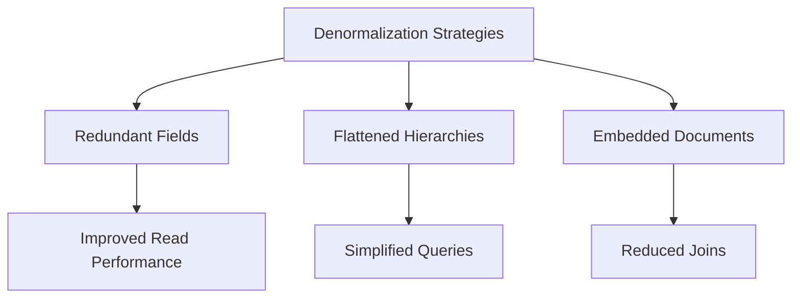

Figure 6.2: Denormalization Strategies

Each example demonstrates a different denormalization technique:
1. Adding redundant calculated fields for faster reads
2. Flattening hierarchical data for easier querying
3. Embedding related data for reduced joins

The trade-off is always between read performance and write complexity/data consistency.

### 6.3 Dimensional Modeling
#### Star Schema Example (E-commerce Analytics)

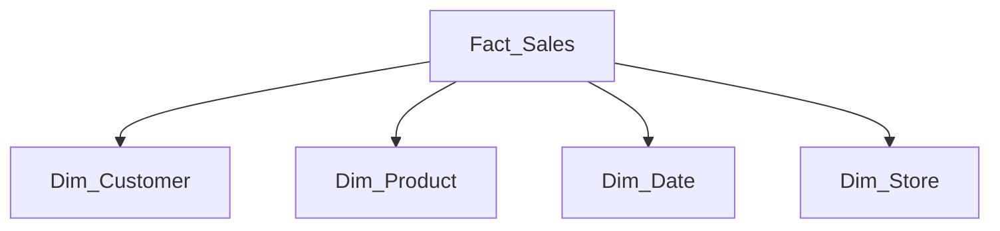

Figure 6.3: Star Schema Structure

**Dimension Tables:**
```sql
-- Date Dimension
CREATE TABLE dim_date (
    date_key INT PRIMARY KEY,
    full_date DATE,
    year INT,
    quarter INT,
    month INT,
    month_name VARCHAR(10),
    week INT,
    day_of_week INT,
    day_name VARCHAR(10),
    is_weekend BOOLEAN,
    is_holiday BOOLEAN
);

-- Product Dimension
CREATE TABLE dim_product (
    product_key INT PRIMARY KEY,
    product_id VARCHAR(20),
    product_name VARCHAR(100),
    category VARCHAR(50),
    subcategory VARCHAR(50),
    brand VARCHAR(50),
    unit_price DECIMAL(10,2),
    supplier_name VARCHAR(100),
    effective_date DATE,
    end_date DATE
);

-- Customer Dimension
CREATE TABLE dim_customer (
    customer_key INT PRIMARY KEY,
    customer_id VARCHAR(20),
    first_name VARCHAR(50),
    last_name VARCHAR(50),
    email VARCHAR(100),
    city VARCHAR(50),
    state VARCHAR(2),
    country VARCHAR(50),
    customer_segment VARCHAR(20)
);

-- Store Dimension
CREATE TABLE dim_store (
    store_key INT PRIMARY KEY,
    store_id VARCHAR(20),
    store_name VARCHAR(100),
    store_type VARCHAR(50),
    address VARCHAR(200),
    city VARCHAR(50),
    state VARCHAR(2),
    country VARCHAR(50),
    region VARCHAR(50)
);
```

**Fact Table:**
```sql
CREATE TABLE fact_sales (
    sale_key BIGINT PRIMARY KEY,
    date_key INT REFERENCES dim_date(date_key),
    product_key INT REFERENCES dim_product(product_key),
    customer_key INT REFERENCES dim_customer(customer_key),
    store_key INT REFERENCES dim_store(store_key),
    quantity INT,
    unit_price DECIMAL(10,2),
    discount_amount DECIMAL(10,2),
    sales_amount DECIMAL(10,2),
    profit_amount DECIMAL(10,2),
    transaction_type VARCHAR(20),
    FOREIGN KEY (date_key) REFERENCES dim_date(date_key),
    FOREIGN KEY (product_key) REFERENCES dim_product(product_key),
    FOREIGN KEY (customer_key) REFERENCES dim_customer(customer_key),
    FOREIGN KEY (store_key) REFERENCES dim_store(store_key)
);
```

#### Snowflake Schema Example (Product Hierarchy)

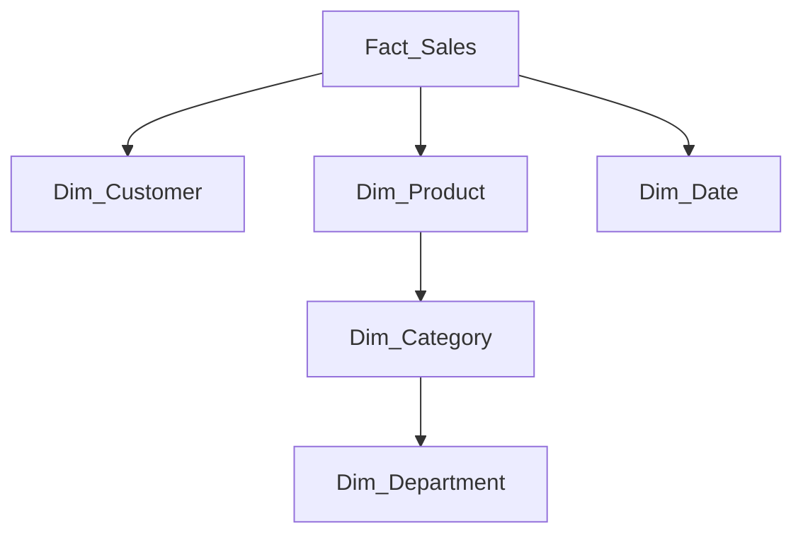

Figure 6.4: Snowflake Schema Structure

**Additional Normalized Dimension Tables:**
```sql
-- Department Dimension
CREATE TABLE dim_department (
    department_key INT PRIMARY KEY,
    department_name VARCHAR(50),
    department_description TEXT
);

-- Category Dimension (normalized from Product)
CREATE TABLE dim_category (
    category_key INT PRIMARY KEY,
    department_key INT,
    category_name VARCHAR(50),
    category_description TEXT,
    FOREIGN KEY (department_key) REFERENCES dim_department(department_key)
);

-- Modified Product Dimension for Snowflake
CREATE TABLE dim_product (
    product_key INT PRIMARY KEY,
    category_key INT,
    product_id VARCHAR(20),
    product_name VARCHAR(100),
    brand VARCHAR(50),
    unit_price DECIMAL(10,2),
    FOREIGN KEY (category_key) REFERENCES dim_category(category_key)
);
```

**Example Analytical Queries:**
```sql
-- Sales by Category and Quarter
SELECT 
    dc.category_name,
    dd.quarter,
    dd.year,
    SUM(fs.sales_amount) as total_sales,
    COUNT(DISTINCT fs.customer_key) as unique_customers
FROM fact_sales fs
JOIN dim_date dd ON fs.date_key = dd.date_key
JOIN dim_product dp ON fs.product_key = dp.product_key
JOIN dim_category dc ON dp.category_key = dc.category_key
GROUP BY dc.category_name, dd.quarter, dd.year
ORDER BY dd.year, dd.quarter, total_sales DESC;

-- Customer Segment Analysis
SELECT 
    dc.customer_segment,
    dp.brand,
    SUM(fs.sales_amount) as total_sales,
    AVG(fs.profit_amount) as avg_profit
FROM fact_sales fs
JOIN dim_customer dc ON fs.customer_key = dc.customer_key
JOIN dim_product dp ON fs.product_key = dp.product_key
GROUP BY dc.customer_segment, dp.brand
HAVING SUM(fs.sales_amount) > 10000
ORDER BY total_sales DESC;
```

Key Characteristics:
1. **Star Schema**
   - Denormalized dimension tables
   - Single join to reach any dimension
   - Optimized for read performance

2. **Snowflake Schema**
   - Normalized dimension tables
   - Multiple joins may be needed
   - Reduces data redundancy

3. **Common Uses**
   - Sales analysis
   - Financial reporting
   - Customer behavior analysis
   - Inventory management

## 7. Data Governance
### 7.1 Data Quality
#### Data Quality Dimensions
- Accuracy: Data reflects real-world values
- Completeness: All required data is present
- Consistency: Data is uniform across the database
- Timeliness: Data is up-to-date

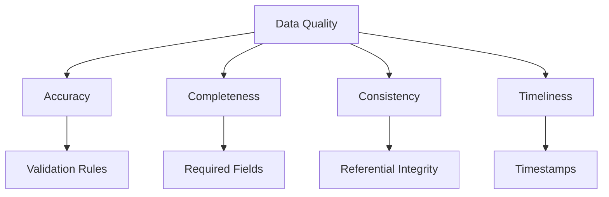

Figure 7.1: Data Quality Dimensions

#### Implementation Examples

**1. Accuracy Checks:**
```sql
-- Domain constraints for valid values
CREATE TABLE employees (
    employee_id INT PRIMARY KEY,
    email VARCHAR(100) CHECK (email LIKE '%@%.%'),
    salary DECIMAL(10,2) CHECK (salary >= 0),
    hire_date DATE CHECK (hire_date <= CURRENT_DATE),
    department VARCHAR(50) CHECK (department IN ('IT', 'HR', 'Sales', 'Marketing'))
);

-- Custom validation function
CREATE OR REPLACE FUNCTION validate_phone_number(phone TEXT)
RETURNS BOOLEAN AS $$
BEGIN
    RETURN phone ~ '^\+?[1-9]\d{1,14}$';
END;
$$ LANGUAGE plpgsql;

ALTER TABLE employees
ADD CONSTRAINT valid_phone 
CHECK (validate_phone_number(phone_number));
```

**2. Completeness Checks:**
```sql
-- Required fields and default values
CREATE TABLE orders (
    order_id SERIAL PRIMARY KEY,
    customer_id INT NOT NULL,
    order_date TIMESTAMP NOT NULL DEFAULT CURRENT_TIMESTAMP,
    status VARCHAR(20) NOT NULL DEFAULT 'pending',
    total_amount DECIMAL(10,2) NOT NULL DEFAULT 0.00,
    
    CONSTRAINT valid_status CHECK (
        status IN ('pending', 'processing', 'shipped', 'delivered', 'cancelled')
    )
);

-- Trigger to ensure all required items are present
CREATE OR REPLACE FUNCTION check_order_items()
RETURNS TRIGGER AS $$
BEGIN
    IF NOT EXISTS (
        SELECT 1 FROM order_items 
        WHERE order_id = NEW.order_id
    ) THEN
        RAISE EXCEPTION 'Order must contain at least one item';
    END IF;
    RETURN NEW;
END;
$$ LANGUAGE plpgsql;

CREATE TRIGGER ensure_order_items
AFTER INSERT ON orders
FOR EACH ROW EXECUTE FUNCTION check_order_items();
```

**3. Consistency Checks:**
```sql
-- Trigger to maintain data consistency
CREATE OR REPLACE FUNCTION update_order_totals()
RETURNS TRIGGER AS $$
BEGIN
    -- Update order total
    UPDATE orders
    SET total_amount = (
        SELECT SUM(quantity * unit_price)
        FROM order_items
        WHERE order_id = NEW.order_id
    )
    WHERE order_id = NEW.order_id;
    
    -- Update inventory
    UPDATE products
    SET stock_quantity = stock_quantity - NEW.quantity
    WHERE product_id = NEW.product_id;
    
    RETURN NEW;
END;
$$ LANGUAGE plpgsql;

CREATE TRIGGER maintain_consistency
AFTER INSERT ON order_items
FOR EACH ROW EXECUTE FUNCTION update_order_totals();
```

**4. Timeliness Checks:**
```sql
-- Tracking data freshness
CREATE TABLE data_freshness (
    table_name VARCHAR(50) PRIMARY KEY,
    last_updated TIMESTAMP NOT NULL DEFAULT CURRENT_TIMESTAMP,
    update_frequency INTERVAL NOT NULL,
    is_stale BOOLEAN GENERATED ALWAYS AS (
        CURRENT_TIMESTAMP - last_updated > update_frequency
    ) STORED
);

-- Monitor data staleness
CREATE OR REPLACE FUNCTION check_data_freshness()
RETURNS TABLE (stale_table VARCHAR(50), last_update TIMESTAMP) AS $$
BEGIN
    RETURN QUERY
    SELECT table_name, last_updated
    FROM data_freshness
    WHERE is_stale = true;
END;
$$ LANGUAGE plpgsql;

-- Automated cleanup of old data
CREATE OR REPLACE FUNCTION cleanup_old_data()
RETURNS void AS $$
BEGIN
    -- Delete logs older than 90 days
    DELETE FROM audit_logs
    WHERE created_at < CURRENT_DATE - INTERVAL '90 days';
    
    -- Archive old orders
    INSERT INTO archived_orders
    SELECT * FROM orders
    WHERE order_date < CURRENT_DATE - INTERVAL '1 year';
    
    DELETE FROM orders
    WHERE order_date < CURRENT_DATE - INTERVAL '1 year';
END;
$$ LANGUAGE plpgsql;
```

**5. Data Quality Monitoring:**
```sql
CREATE TABLE data_quality_metrics (
    metric_id SERIAL PRIMARY KEY,
    table_name VARCHAR(50),
    check_type VARCHAR(20),
    check_description TEXT,
    failed_records INT,
    check_timestamp TIMESTAMP DEFAULT CURRENT_TIMESTAMP
);

-- Example quality check procedure
CREATE OR REPLACE PROCEDURE run_quality_checks()
LANGUAGE plpgsql AS $$
BEGIN
    -- Check for invalid emails
    INSERT INTO data_quality_metrics (table_name, check_type, check_description, failed_records)
    SELECT 
        'employees',
        'accuracy',
        'Invalid email addresses',
        COUNT(*)
    FROM employees
    WHERE email NOT LIKE '%@%.%';
    
    -- Check for incomplete orders
    INSERT INTO data_quality_metrics (table_name, check_type, check_description, failed_records)
    SELECT 
        'orders',
        'completeness',
        'Orders without items',
        COUNT(*)
    FROM orders o
    LEFT JOIN order_items oi ON o.order_id = oi.order_id
    WHERE oi.order_id IS NULL;
    
    -- Check for data consistency
    INSERT INTO data_quality_metrics (table_name, check_type, check_description, failed_records)
    SELECT 
        'orders',
        'consistency',
        'Order totals mismatch',
        COUNT(*)
    FROM orders o
    WHERE o.total_amount != (
        SELECT COALESCE(SUM(quantity * unit_price), 0)
        FROM order_items
        WHERE order_id = o.order_id
    );
END;
$$;
```

These examples demonstrate:
1. Data validation using constraints and custom functions
2. Completeness enforcement through triggers
3. Consistency maintenance across related tables
4. Timeliness tracking and automated cleanup
5. Quality monitoring and reporting system

The implementation provides both preventive (constraints, triggers) and detective (monitoring, reporting) controls for maintaining data quality.

### 7.2 Data Dictionary
```sql
CREATE TABLE data_dictionary (
    table_name VARCHAR(50),
    column_name VARCHAR(50),
    data_type VARCHAR(30),
    description TEXT,
    business_rules TEXT,
    PRIMARY KEY (table_name, column_name)
);
```

## 8. Policy
### 8.1 Naming Conventions

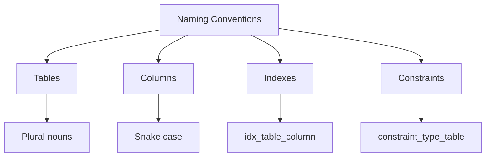

Figure 8.1: Naming Convention Structure

#### Table Naming
```sql
-- ✅ Good Examples
CREATE TABLE customers (...)        -- Plural noun
CREATE TABLE order_items (...)      -- Compound name with underscore
CREATE TABLE user_preferences (...)  -- Clear relationship indication

-- ❌ Bad Examples
CREATE TABLE customer (...)         -- Singular
CREATE TABLE tbl_users (...)        -- Unnecessary prefix
CREATE TABLE UserPrefs (...)        -- Mixed case
```

#### Column Naming
```sql
-- ✅ Good Examples
CREATE TABLE users (
    user_id SERIAL PRIMARY KEY,     -- Clear identifier
    first_name VARCHAR(50),         -- Logical separation
    last_login_at TIMESTAMP,        -- Time suffix for timestamps
    is_active BOOLEAN,              -- Boolean prefix
    created_by_id INTEGER           -- Reference suffix
);

-- ❌ Bad Examples
CREATE TABLE users (
    id SERIAL PRIMARY KEY,          -- Too generic
    fname VARCHAR(50),              -- Unclear abbreviation
    lastlogin TIMESTAMP,            -- No separation
    active BOOLEAN,                 -- Ambiguous meaning
    creator INTEGER                 -- Unclear relationship
);
```

#### Index Naming
```sql
-- ✅ Good Examples
CREATE INDEX idx_users_email 
    ON users(email);               -- Simple index

CREATE INDEX idx_orders_customer_date 
    ON orders(customer_id, order_date);  -- Composite index

CREATE UNIQUE INDEX idx_products_sku_unq 
    ON products(sku);              -- Unique index

-- ❌ Bad Examples
CREATE INDEX email_idx 
    ON users(email);               -- Inconsistent format

CREATE INDEX idx1 
    ON orders(customer_id);        -- Non-descriptive
```

#### Constraint Naming
```sql
-- ✅ Good Examples
CREATE TABLE orders (
    order_id SERIAL,
    customer_id INTEGER,
    status VARCHAR(20),
    
    CONSTRAINT pk_orders_order_id 
        PRIMARY KEY (order_id),
    CONSTRAINT fk_orders_customer_id 
        FOREIGN KEY (customer_id) REFERENCES customers(customer_id),
    CONSTRAINT chk_orders_status 
        CHECK (status IN ('pending', 'completed', 'cancelled')),
    CONSTRAINT uq_orders_tracking_number 
        UNIQUE (tracking_number)
);

-- ❌ Bad Examples
CREATE TABLE orders (
    order_id SERIAL PRIMARY KEY,    -- Anonymous constraint
    customer_id INTEGER REFERENCES customers(customer_id),  -- Anonymous FK
    status VARCHAR(20) CHECK (status IN ('pending', 'completed'))  -- Anonymous check
);
```

#### Trigger and Function Naming
```sql
-- ✅ Good Examples
CREATE TRIGGER trg_orders_before_insert
    BEFORE INSERT ON orders
    FOR EACH ROW
    EXECUTE FUNCTION fn_orders_update_inventory();

CREATE FUNCTION fn_calculate_order_total(order_id INTEGER)
    RETURNS DECIMAL(10,2) AS $$
    -- Function body
$$ LANGUAGE plpgsql;

-- ❌ Bad Examples
CREATE TRIGGER update_inventory
    AFTER INSERT ON orders...      -- Purpose not clear in name

CREATE FUNCTION calc_total(id INTEGER)...  -- Too generic
```

#### View Naming
```sql
-- ✅ Good Examples
CREATE VIEW vw_active_customers AS
    SELECT * FROM customers 
    WHERE is_active = true;

CREATE VIEW vw_order_summary_daily AS
    SELECT 
        order_date::date,
        COUNT(*) as order_count,
        SUM(total_amount) as total_sales
    FROM orders
    GROUP BY order_date::date;

-- ❌ Bad Examples
CREATE VIEW active AS...           -- Too brief
CREATE VIEW customer_view AS...    -- Redundant 'view' in name
```

#### Naming Convention Rules Summary:
1. **Tables**
   - Use plural nouns
   - Use lowercase with underscores
   - Be descriptive and clear
   - Avoid prefixes like 'tbl_'

2. **Columns**
   - Use singular descriptive names
   - Use lowercase with underscores
   - Include units in name if applicable
   - Use consistent suffixes (_id, _at, _count)

3. **Indexes**
   - Prefix with 'idx_'
   - Include table and column names
   - Add suffix for special types (_unq, _btree)

4. **Constraints**
   - Prefix with constraint type (pk_, fk_, chk_, uq_)
   - Include table and column names
   - Be descriptive about the rule

5. **General Rules**
   - Use lowercase for SQL keywords
   - Use underscores for word separation
   - Be consistent across the database
   - Avoid reserved words

### 8.2 Documentation Requirements
- Schema documentation
- Relationship documentation
- Business rule documentation
- Change management

## 9. Security
### 9.1 Access Control
```sql
-- Role-based access control example
CREATE ROLE app_readonly;
GRANT SELECT ON ALL TABLES IN SCHEMA public TO app_readonly;

CREATE ROLE app_writer;
GRANT SELECT, INSERT, UPDATE ON ALL TABLES IN SCHEMA public TO app_writer;
```

### 9.2 Data Protection

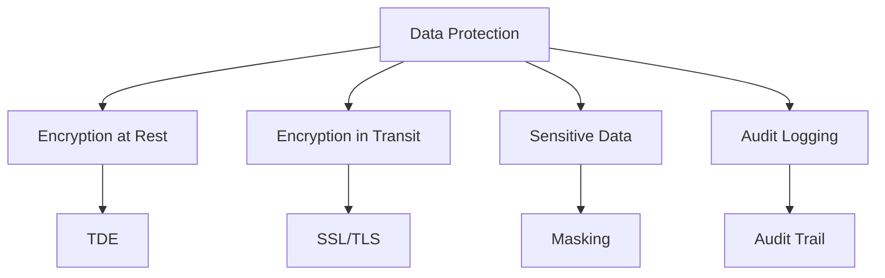

Figure 9.1: Data Protection Strategies

#### 1. Encryption at Rest
```sql
-- Enable PostgreSQL encryption at rest (TDE)
ALTER SYSTEM SET ssl = on;
ALTER SYSTEM SET ssl_cipher = 'HIGH:MEDIUM:+3DES:!aNULL';

-- Encrypted tablespace
CREATE TABLESPACE encrypted_space
    LOCATION '/secure/data'
    WITH (encryption_algorithm = 'AES_256');

-- Store sensitive tables in encrypted tablespace
CREATE TABLE customer_data (
    customer_id SERIAL PRIMARY KEY,
    ssn VARCHAR(11) ENCRYPTED WITH KEY KEYID 1,
    credit_card VARCHAR(16) ENCRYPTED WITH KEY KEYID 1
) TABLESPACE encrypted_space;

-- Encrypted backup
CREATE OR REPLACE FUNCTION backup_encrypted_data()
RETURNS void AS $$
BEGIN
    PERFORM pg_export_snapshot() WITH ENCRYPTION KEY 'your-encryption-key';
END;
$$ LANGUAGE plpgsql;
```

#### 2. Encryption in Transit
```sql
-- Configure SSL/TLS
ALTER SYSTEM SET ssl = on;
ALTER SYSTEM SET ssl_cert_file = 'server.crt';
ALTER SYSTEM SET ssl_key_file = 'server.key';

-- Force SSL connections
ALTER USER app_user SET ssl = on;
ALTER DATABASE secure_db SET ssl = on;

-- Create user with SSL requirement
CREATE USER secure_user WITH PASSWORD 'strong_password' SSL REQUIRED;
```

#### 3. Sensitive Data Handling
```sql
-- Create encrypted columns for sensitive data
CREATE EXTENSION pgcrypto;

-- Table with encrypted columns
CREATE TABLE patient_records (
    patient_id SERIAL PRIMARY KEY,
    name TEXT,
    -- Encrypted columns
    ssn TEXT GENERATED ALWAYS AS (
        encode(
            pgp_sym_encrypt(
                ssn_plain::text,
                current_setting('app.encryption_key')
            ),
            'base64'
        )
    ) STORED,
    medical_notes TEXT GENERATED ALWAYS AS (
        encode(
            pgp_sym_encrypt(
                medical_notes_plain::text,
                current_setting('app.encryption_key')
            ),
            'base64'
        )
    ) STORED,
    -- Plain columns for encryption
    ssn_plain TEXT,
    medical_notes_plain TEXT,
    -- Mask certain data for non-privileged users
    SECURITY LABEL FOR mask_policy ON COLUMN ssn IS 'MASK'
);

-- Function to decrypt data (restricted access)
CREATE OR REPLACE FUNCTION decrypt_sensitive_data(encrypted_data text)
RETURNS text AS $$
BEGIN
    RETURN pgp_sym_decrypt(
        decode(encrypted_data, 'base64'),
        current_setting('app.encryption_key')
    )::text;
END;
$$ LANGUAGE plpgsql SECURITY DEFINER;

-- Data masking view for regular users
CREATE VIEW patient_records_masked AS
SELECT 
    patient_id,
    name,
    CASE WHEN has_privilege(current_user, 'ADMIN')
         THEN decrypt_sensitive_data(ssn::text)
         ELSE 'XXX-XX-' || RIGHT(decrypt_sensitive_data(ssn::text), 4)
    END as ssn,
    CASE WHEN has_privilege(current_user, 'MEDICAL_STAFF')
         THEN decrypt_sensitive_data(medical_notes::text)
         ELSE 'RESTRICTED'
    END as medical_notes
FROM patient_records;
```

#### 4. Audit Logging
```sql
-- Create audit log table
CREATE TABLE audit_log (
    audit_id BIGSERIAL PRIMARY KEY,
    table_name VARCHAR(50),
    operation VARCHAR(20),
    old_data JSONB,
    new_data JSONB,
    changed_by VARCHAR(50),
    changed_at TIMESTAMP DEFAULT CURRENT_TIMESTAMP,
    client_ip INET,
    application_user VARCHAR(50)
);

-- Audit trigger function
CREATE OR REPLACE FUNCTION audit_trigger_func()
RETURNS TRIGGER AS $$
DECLARE
    old_row JSONB;
    new_row JSONB;
BEGIN
    IF (TG_OP = 'DELETE') THEN
        old_row = row_to_json(OLD)::JSONB;
        new_row = NULL;
    ELSIF (TG_OP = 'INSERT') THEN
        old_row = NULL;
        new_row = row_to_json(NEW)::JSONB;
    ELSE
        old_row = row_to_json(OLD)::JSONB;
        new_row = row_to_json(NEW)::JSONB;
    END IF;

    INSERT INTO audit_log (
        table_name,
        operation,
        old_data,
        new_data,
        changed_by,
        client_ip,
        application_user
    ) VALUES (
        TG_TABLE_NAME,
        TG_OP,
        old_row,
        new_row,
        current_user,
        inet_client_addr(),
        current_setting('app.user_name', TRUE)
    );

    RETURN NEW;
END;
$$ LANGUAGE plpgsql SECURITY DEFINER;

-- Apply audit trigger to sensitive tables
CREATE TRIGGER audit_patient_records
AFTER INSERT OR UPDATE OR DELETE ON patient_records
FOR EACH ROW EXECUTE FUNCTION audit_trigger_func();

-- Function to query audit trail
CREATE OR REPLACE FUNCTION get_audit_trail(
    p_table_name VARCHAR,
    p_start_date TIMESTAMP,
    p_end_date TIMESTAMP
) RETURNS TABLE (
    audit_id BIGINT,
    operation VARCHAR,
    changed_by VARCHAR,
    changed_at TIMESTAMP,
    changes JSONB
) AS $$
BEGIN
    RETURN QUERY
    SELECT 
        al.audit_id,
        al.operation,
        al.changed_by,
        al.changed_at,
        CASE 
            WHEN al.operation = 'INSERT' THEN al.new_data
            WHEN al.operation = 'DELETE' THEN al.old_data
            ELSE jsonb_diff_val(al.old_data, al.new_data)
        END as changes
    FROM audit_log al
    WHERE al.table_name = p_table_name
    AND al.changed_at BETWEEN p_start_date AND p_end_date
    ORDER BY al.changed_at DESC;
END;
$$ LANGUAGE plpgsql;
```

These examples demonstrate:
1. Encryption at rest using TDE and encrypted tablespaces
2. SSL/TLS configuration for encryption in transit
3. Column-level encryption and data masking for sensitive data
4. Comprehensive audit logging system with change tracking

Best practices implemented:
- Multiple layers of encryption
- Role-based access control
- Data masking for unauthorized users
- Detailed audit trail
- Secure functions with SECURITY DEFINER
- IP address tracking
- Application user context

### 9.3 Compliance

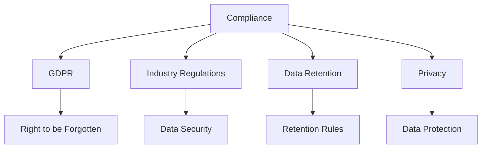

Figure 9.2: Compliance Framework

#### 1. GDPR Implementation
```sql
-- Personal Data Tracking
CREATE TABLE personal_data_inventory (
    table_name VARCHAR(100),
    column_name VARCHAR(100),
    data_category VARCHAR(50),
    retention_period INTERVAL,
    legal_basis VARCHAR(50),
    is_sensitive BOOLEAN,
    requires_consent BOOLEAN,
    PRIMARY KEY (table_name, column_name)
);

-- Data Subject Rights Management
CREATE TABLE data_subject_requests (
    request_id SERIAL PRIMARY KEY,
    subject_id VARCHAR(100),
    request_type VARCHAR(50) CHECK (
        request_type IN (
            'ACCESS', 'RECTIFICATION', 'ERASURE',
            'RESTRICT', 'PORTABILITY', 'OBJECT'
        )
    ),
    status VARCHAR(20) DEFAULT 'PENDING',
    requested_at TIMESTAMP DEFAULT CURRENT_TIMESTAMP,
    completed_at TIMESTAMP,
    notes TEXT
);

-- Right to be Forgotten Implementation
CREATE OR REPLACE PROCEDURE handle_erasure_request(p_user_id VARCHAR)
LANGUAGE plpgsql
SECURITY DEFINER
AS $$
BEGIN
    -- Anonymize user data
    UPDATE users
    SET 
        email = 'anonymized_' || MD5(email),
        name = 'REDACTED',
        phone = NULL,
        address = NULL,
        is_anonymized = TRUE,
        anonymized_at = CURRENT_TIMESTAMP
    WHERE user_id = p_user_id;

    -- Archive for compliance
    INSERT INTO data_deletion_log (
        user_id,
        deletion_date,
        request_id
    ) VALUES (
        p_user_id,
        CURRENT_TIMESTAMP,
        currval('data_subject_requests_request_id_seq')
    );
END;
$$;
```

#### 2. Data Retention Policies
```sql
-- Retention Policy Configuration
CREATE TABLE retention_policies (
    policy_id SERIAL PRIMARY KEY,
    table_name VARCHAR(100),
    retention_period INTERVAL,
    archive_procedure VARCHAR(100),
    deletion_procedure VARCHAR(100),
    legal_requirement TEXT,
    last_executed TIMESTAMP
);

-- Automated Data Retention Management
CREATE OR REPLACE PROCEDURE execute_retention_policy()
LANGUAGE plpgsql
AS $$
DECLARE
    r RECORD;
BEGIN
    FOR r IN SELECT * FROM retention_policies WHERE 
        (last_executed IS NULL OR 
         last_executed < CURRENT_TIMESTAMP - INTERVAL '1 day')
    LOOP
        -- Archive old data
        EXECUTE format(
            'INSERT INTO %I_archive 
             SELECT * FROM %I 
             WHERE created_at < CURRENT_TIMESTAMP - %L',
            r.table_name, r.table_name, r.retention_period
        );

        -- Delete archived data
        EXECUTE format(
            'DELETE FROM %I 
             WHERE created_at < CURRENT_TIMESTAMP - %L',
            r.table_name, r.retention_period
        );

        -- Update execution timestamp
        UPDATE retention_policies
        SET last_executed = CURRENT_TIMESTAMP
        WHERE policy_id = r.policy_id;
    END LOOP;
END;
$$;
```

#### 3. Privacy Controls
```sql
-- Consent Management
CREATE TABLE consent_records (
    consent_id SERIAL PRIMARY KEY,
    user_id VARCHAR(100),
    purpose VARCHAR(100),
    consent_given BOOLEAN,
    consent_timestamp TIMESTAMP,
    expiry_date TIMESTAMP,
    consent_source VARCHAR(50),
    consent_version VARCHAR(20),
    UNIQUE (user_id, purpose)
);

-- Privacy Policy Versioning
CREATE TABLE privacy_policy_versions (
    version_id SERIAL PRIMARY KEY,
    version_number VARCHAR(20),
    effective_date TIMESTAMP,
    content TEXT,
    changes_summary TEXT,
    approved_by VARCHAR(100),
    created_at TIMESTAMP DEFAULT CURRENT_TIMESTAMP
);

-- Data Processing Register
CREATE TABLE data_processing_activities (
    activity_id SERIAL PRIMARY KEY,
    process_name VARCHAR(200),
    purpose TEXT,
    data_categories TEXT[],
    legal_basis VARCHAR(100),
    recipients TEXT[],
    retention_period INTERVAL,
    security_measures TEXT[],
    cross_border_transfer BOOLEAN,
    dpia_required BOOLEAN,
    last_review_date TIMESTAMP
);
```

#### 4. Industry-Specific Compliance
```sql
-- Healthcare (HIPAA) Example
CREATE TABLE phi_access_log (
    access_id SERIAL PRIMARY KEY,
    patient_id VARCHAR(100),
    accessed_by VARCHAR(100),
    access_timestamp TIMESTAMP DEFAULT CURRENT_TIMESTAMP,
    access_type VARCHAR(50),
    reason_code VARCHAR(50),
    system_ip INET,
    success BOOLEAN,
    CONSTRAINT valid_access_type CHECK (
        access_type IN ('VIEW', 'MODIFY', 'EXPORT', 'DELETE')
    )
);

-- Financial (PCI DSS) Example
CREATE TABLE payment_card_data (
    transaction_id SERIAL PRIMARY KEY,
    card_number_encrypted BYTEA,
    card_holder_name_encrypted BYTEA,
    expiry_date_encrypted BYTEA,
    last_four CHAR(4),
    card_type VARCHAR(20),
    tokenization_id VARCHAR(100),
    encryption_key_id INTEGER,
    created_at TIMESTAMP DEFAULT CURRENT_TIMESTAMP,
    CONSTRAINT mask_card_type CHECK (
        card_type IN ('VISA', 'MASTERCARD', 'AMEX', 'OTHER')
    )
);
```

#### 5. Compliance Monitoring
```sql
-- Compliance Audit Configuration
CREATE TABLE compliance_checks (
    check_id SERIAL PRIMARY KEY,
    check_name VARCHAR(200),
    check_type VARCHAR(50),
    query TEXT,
    frequency INTERVAL,
    last_run TIMESTAMP,
    alert_threshold INTEGER,
    alert_contacts TEXT[]
);

-- Automated Compliance Monitoring
CREATE OR REPLACE PROCEDURE run_compliance_checks()
LANGUAGE plpgsql
AS $$
DECLARE
    r RECORD;
    check_result INTEGER;
BEGIN
    FOR r IN SELECT * FROM compliance_checks WHERE 
        (last_run IS NULL OR 
         last_run < CURRENT_TIMESTAMP - frequency)
    LOOP
        -- Execute compliance check
        EXECUTE r.query INTO check_result;

        -- Log results
        INSERT INTO compliance_check_results (
            check_id,
            run_timestamp,
            result_value,
            passed
        ) VALUES (
            r.check_id,
            CURRENT_TIMESTAMP,
            check_result,
            check_result <= r.alert_threshold
        );

        -- Send alerts if threshold exceeded
        IF check_result > r.alert_threshold THEN
            PERFORM send_compliance_alert(
                r.check_name,
                check_result,
                r.alert_contacts
            );
        END IF;

        -- Update last run timestamp
        UPDATE compliance_checks
        SET last_run = CURRENT_TIMESTAMP
        WHERE check_id = r.check_id;
    END LOOP;
END;
$$;
```

Best Practices:
1. **Data Protection**
   - Encryption for sensitive data
   - Access logging
   - Data minimization

2. **Consent Management**
   - Explicit consent tracking
   - Purpose limitation
   - Consent withdrawal handling

3. **Data Retention**
   - Automated archival
   - Secure deletion
   - Retention period tracking

4. **Audit Trail**
   - Comprehensive logging
   - Access monitoring
   - Change tracking

5. **Documentation**
   - Policy versioning
   - Processing activities
   - Security measures

## Best Practices
1. Start with business requirements
2. Use appropriate normalization level
3. Plan for scalability
4. Document everything
5. Consider security from the start
6. Regular review and updates
7. Performance testing
8. Backup and recovery planning

## Common Pitfalls
1. Over-normalization
2. Inadequate indexing
3. Poor naming conventions
4. Insufficient documentation
5. Ignoring scalability
6. Weak security controls
7. Missing backup strategies

## 10. Incremental Design for support multiple versions

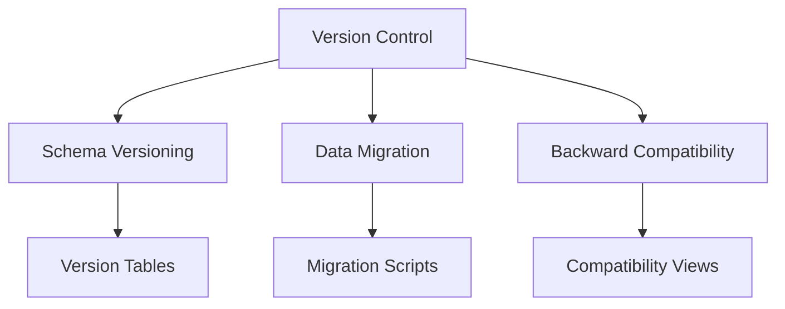

Figure 10.1: Version Control Strategy

### 10.1 Schema Version Control
```sql
-- Schema version tracking
CREATE TABLE schema_versions (
    version_id SERIAL PRIMARY KEY,
    version_number VARCHAR(20),
    description TEXT,
    applied_at TIMESTAMP DEFAULT CURRENT_TIMESTAMP,
    applied_by VARCHAR(100),
    script_name VARCHAR(200),
    checksum VARCHAR(64),
    status VARCHAR(20)
);

-- Track schema changes
CREATE OR REPLACE PROCEDURE record_schema_change(
    p_version VARCHAR,
    p_description TEXT,
    p_script_name VARCHAR
)
LANGUAGE plpgsql AS $$
BEGIN
    INSERT INTO schema_versions (
        version_number,
        description,
        script_name,
        applied_by,
        checksum
    ) VALUES (
        p_version,
        p_description,
        p_script_name,
        current_user,
        MD5(p_script_name || CURRENT_TIMESTAMP)
    );
END;
$$;
```
```sql
-- 1. Initial Schema Setup Example
INSERT INTO schema_versions (
    version_number,
    description,
    script_name,
    status
) VALUES 
('1.0.0', 'Initial database setup', 'V1_0_0__initial_setup.sql', 'APPLIED');

-- 2. Example of Recording Schema Changes
CALL record_schema_change(
    '1.0.1',
    'Add user preferences table',
    'V1_0_1__add_user_preferences.sql'
);

CALL record_schema_change(
    '1.0.2',
    'Add email verification column to users',
    'V1_0_2__add_email_verification.sql'
);

-- 3. Example Migration Script
CREATE OR REPLACE PROCEDURE apply_schema_migration(
    p_target_version VARCHAR
)
LANGUAGE plpgsql AS $$
DECLARE
    current_ver VARCHAR;
BEGIN
    -- Get current version
    SELECT version_number INTO current_ver
    FROM schema_versions
    WHERE status = 'APPLIED'
    ORDER BY applied_at DESC
    LIMIT 1;

    -- Example migration logic
    IF p_target_version = '1.0.1' AND current_ver = '1.0.0' THEN
        -- Create user preferences table
        CREATE TABLE user_preferences (
            user_id INTEGER PRIMARY KEY,
            theme VARCHAR(20),
            notifications BOOLEAN,
            created_at TIMESTAMP DEFAULT CURRENT_TIMESTAMP
        );

        -- Record the change
        CALL record_schema_change(
            '1.0.1',
            'Add user preferences table',
            'V1_0_1__add_user_preferences.sql'
        );
    END IF;

    IF p_target_version = '1.0.2' AND current_ver = '1.0.1' THEN
        -- Add email verification column
        ALTER TABLE users 
        ADD COLUMN email_verified BOOLEAN DEFAULT FALSE;

        -- Record the change
        CALL record_schema_change(
            '1.0.2',
            'Add email verification column',
            'V1_0_2__add_email_verification.sql'
        );
    END IF;
END;
$$;

-- 4. Query Schema Version History
CREATE OR REPLACE FUNCTION get_schema_history()
RETURNS TABLE (
    version VARCHAR,
    description TEXT,
    applied_at TIMESTAMP,
    applied_by VARCHAR,
    status VARCHAR
) AS $$
BEGIN
    RETURN QUERY
    SELECT 
        version_number,
        sv.description,
        sv.applied_at,
        sv.applied_by,
        sv.status
    FROM schema_versions sv
    ORDER BY sv.applied_at;
END;
$$ LANGUAGE plpgsql;

-- 5. Usage Examples

-- Check current schema version
SELECT version_number, applied_at
FROM schema_versions
WHERE status = 'APPLIED'
ORDER BY applied_at DESC
LIMIT 1;

-- View full migration history
SELECT * FROM get_schema_history();

-- Apply new migration
CALL apply_schema_migration('1.0.1');

-- Verify specific version
SELECT EXISTS (
    SELECT 1 
    FROM schema_versions 
    WHERE version_number = '1.0.1' 
    AND status = 'APPLIED'
) as version_applied;

-- Example Output:
/*
 Schema Version History:
 Version | Description              | Applied At           | Status
 --------+------------------------+--------------------+--------
 1.0.0   | Initial database setup  | 2024-01-01 10:00:00 | APPLIED
 1.0.1   | Add user preferences    | 2024-01-02 11:30:00 | APPLIED
 1.0.2   | Add email verification  | 2024-01-03 14:15:00 | APPLIED
*/

-- 6. Rollback Example
CREATE OR REPLACE PROCEDURE rollback_schema_version(
    p_version VARCHAR
)
LANGUAGE plpgsql AS $$
DECLARE
    current_ver VARCHAR;
BEGIN
    -- Get current version
    SELECT version_number INTO current_ver
    FROM schema_versions
    WHERE status = 'APPLIED'
    ORDER BY applied_at DESC
    LIMIT 1;

    -- Example rollback logic
    IF current_ver = '1.0.2' AND p_version = '1.0.1' THEN
        -- Rollback email verification column
        ALTER TABLE users 
        DROP COLUMN email_verified;

        -- Update schema version status
        UPDATE schema_versions
        SET status = 'ROLLED_BACK'
        WHERE version_number = '1.0.2';
    END IF;

    -- Record rollback
    INSERT INTO schema_versions (
        version_number,
        description,
        script_name,
        status
    ) VALUES (
        current_ver || '_rollback',
        'Rollback to version ' || p_version,
        'R' || current_ver || '_to_' || p_version || '.sql',
        'ROLLBACK_COMPLETE'
    );
END;
$$;

-- Usage:
CALL rollback_schema_version('1.0.1');
```

### 10.2 Incremental Table Design
```sql
-- Example: Product catalog with versioning
CREATE TABLE products_v1 (
    product_id SERIAL PRIMARY KEY,
    name VARCHAR(100),
    price DECIMAL(10,2),
    created_at TIMESTAMP DEFAULT CURRENT_TIMESTAMP
);

-- Version 2: Add new fields with backward compatibility
CREATE TABLE products_v2 (
    product_id SERIAL PRIMARY KEY,
    name VARCHAR(100),
    price DECIMAL(10,2),
    description TEXT,
    category_id INTEGER,
    created_at TIMESTAMP DEFAULT CURRENT_TIMESTAMP,
    updated_at TIMESTAMP,
    version INT DEFAULT 2
);

-- Compatibility view for v1 clients
CREATE VIEW products_v1_view AS
SELECT 
    product_id,
    name,
    price,
    created_at
FROM products_v2;

-- Function to handle version-specific inserts
CREATE OR REPLACE FUNCTION insert_product(
    p_name VARCHAR,
    p_price DECIMAL,
    p_description TEXT DEFAULT NULL,
    p_category_id INTEGER DEFAULT NULL,
    p_version INTEGER DEFAULT 2
)
RETURNS INTEGER AS $$
DECLARE
    v_product_id INTEGER;
BEGIN
    IF p_version = 1 THEN
        INSERT INTO products_v2 (name, price)
        VALUES (p_name, p_price)
        RETURNING product_id INTO v_product_id;
    ELSE
        INSERT INTO products_v2 (
            name, 
            price, 
            description, 
            category_id,
            version
        )
        VALUES (
            p_name, 
            p_price, 
            p_description, 
            p_category_id,
            p_version
        )
        RETURNING product_id INTO v_product_id;
    END IF;
    
    RETURN v_product_id;
END;
$$ LANGUAGE plpgsql;
```

### 10.3 Data Migration Strategy
```sql
-- Migration tracking
CREATE TABLE migration_jobs (
    job_id SERIAL PRIMARY KEY,
    from_version VARCHAR(20),
    to_version VARCHAR(20),
    started_at TIMESTAMP DEFAULT CURRENT_TIMESTAMP,
    completed_at TIMESTAMP,
    status VARCHAR(20),
    error_message TEXT,
    affected_rows INTEGER
);

-- Migration procedure
CREATE OR REPLACE PROCEDURE migrate_data(
    p_from_version VARCHAR,
    p_to_version VARCHAR
)
LANGUAGE plpgsql AS $$
DECLARE
    v_job_id INTEGER;
    v_affected INTEGER;
BEGIN
    -- Create migration job
    INSERT INTO migration_jobs (from_version, to_version, status)
    VALUES (p_from_version, p_to_version, 'IN_PROGRESS')
    RETURNING job_id INTO v_job_id;
    
    -- Example migration from v1 to v2
    IF p_from_version = '1' AND p_to_version = '2' THEN
        -- Migrate data with new structure
        WITH migrated AS (
            INSERT INTO products_v2 (
                product_id,
                name,
                price,
                description,
                created_at,
                version
            )
            SELECT 
                product_id,
                name,
                price,
                'Migrated from v1',  -- Default description
                created_at,
                2  -- New version
            FROM products_v1
            RETURNING 1
        )
        SELECT COUNT(*) INTO v_affected FROM migrated;
        
        -- Update migration status
        UPDATE migration_jobs
        SET 
            status = 'COMPLETED',
            completed_at = CURRENT_TIMESTAMP,
            affected_rows = v_affected
        WHERE job_id = v_job_id;
    END IF;
    
EXCEPTION WHEN OTHERS THEN
    -- Record failure
    UPDATE migration_jobs
    SET 
        status = 'FAILED',
        completed_at = CURRENT_TIMESTAMP,
        error_message = SQLERRM
    WHERE job_id = v_job_id;
    
    RAISE;
END;
$$;
```

### 10.4 API Version Management
```sql
-- API version configuration
CREATE TABLE api_versions (
    version_id SERIAL PRIMARY KEY,
    version_number VARCHAR(20),
    active BOOLEAN DEFAULT true,
    deprecated BOOLEAN DEFAULT false,
    sunset_date DATE,
    features JSONB
);

-- Version-specific function routing
CREATE OR REPLACE FUNCTION get_product(
    p_product_id INTEGER,
    p_api_version VARCHAR
)
RETURNS JSONB AS $$
BEGIN
    CASE p_api_version
        WHEN '1.0' THEN
            RETURN (
                SELECT jsonb_build_object(
                    'product_id', product_id,
                    'name', name,
                    'price', price,
                    'created_at', created_at
                )
                FROM products_v1_view
                WHERE product_id = p_product_id
            );
            
        WHEN '2.0' THEN
            RETURN (
                SELECT jsonb_build_object(
                    'product_id', product_id,
                    'name', name,
                    'price', price,
                    'description', description,
                    'category_id', category_id,
                    'created_at', created_at,
                    'updated_at', updated_at
                )
                FROM products_v2
                WHERE product_id = p_product_id
            );
            
        ELSE
            RAISE EXCEPTION 'Unsupported API version: %', p_api_version;
    END CASE;
END;
$$ LANGUAGE plpgsql;
```

Best Practices for Version Control:
1. **Schema Management**
   - Track all schema changes
   - Use version numbers consistently
   - Maintain change history

2. **Backward Compatibility**
   - Create compatibility views
   - Support multiple API versions
   - Plan for deprecation

3. **Data Migration**
   - Implement incremental migration
   - Track migration progress
   - Handle failures gracefully

4. **Version Control**
   - Use semantic versioning
   - Document breaking changes
   - Maintain migration scripts

5. **Testing**
   - Test all supported versions
   - Validate data migration
   - Verify compatibility

## 11. NTP Server Configuration

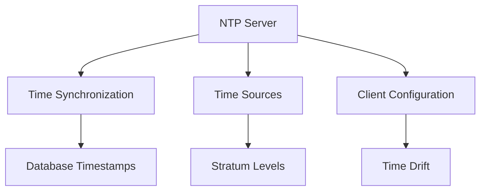

Figure 11.1: NTP Server Architecture

### 11.1 Time Synchronization Importance
- Transaction ordering
- Audit trail accuracy
- Replication consistency
- Compliance requirements
- Performance monitoring

### 11.2 NTP Server Setup
```sql
-- Create time monitoring table
CREATE TABLE time_sync_status (
    check_id SERIAL PRIMARY KEY,
    server_time TIMESTAMP WITH TIME ZONE,
    ntp_time TIMESTAMP WITH TIME ZONE,
    drift_seconds NUMERIC(10,3),
    check_timestamp TIMESTAMP WITH TIME ZONE DEFAULT CURRENT_TIMESTAMP,
    status VARCHAR(20)
);

-- Function to check time drift
CREATE OR REPLACE FUNCTION check_time_drift()
RETURNS void AS $$
DECLARE
    v_ntp_time TIMESTAMP WITH TIME ZONE;
    v_drift NUMERIC(10,3);
BEGIN
    -- Get NTP time (this would normally come from NTP server)
    SELECT NOW() INTO v_ntp_time;
    
    -- Calculate drift
    SELECT EXTRACT(EPOCH FROM (NOW() - v_ntp_time)) INTO v_drift;
    
    -- Record status
    INSERT INTO time_sync_status (
        server_time,
        ntp_time,
        drift_seconds,
        status
    ) VALUES (
        NOW(),
        v_ntp_time,
        v_drift,
        CASE 
            WHEN ABS(v_drift) > 1 THEN 'DRIFT_WARNING'
            ELSE 'SYNCHRONIZED'
        END
    );
    
    -- Alert if drift is too high
    IF ABS(v_drift) > 1 THEN
        RAISE WARNING 'Time drift detected: % seconds', v_drift;
    END IF;
END;
$$ LANGUAGE plpgsql;
```

### 11.3 Client Configuration
```bash
# PostgreSQL postgresql.conf settings
# Enable timestamp precision
track_commit_timestamp = on
log_timezone = 'UTC'
timezone = 'UTC'

# NTP client configuration (/etc/ntp.conf)
server ntp1.example.com iburst
server ntp2.example.com iburst
server ntp3.example.com iburst

# Drift file
driftfile /var/lib/ntp/ntp.drift

# Access control
restrict default kod nomodify notrap nopeer noquery
restrict 127.0.0.1
restrict ::1
```

### 11.4 Monitoring and Alerts
```sql
-- Create monitoring function
CREATE OR REPLACE FUNCTION monitor_time_sync()
RETURNS TABLE (
    status VARCHAR(20),
    avg_drift NUMERIC(10,3),
    max_drift NUMERIC(10,3),
    checks_count INTEGER
) AS $$
BEGIN
    RETURN QUERY
    SELECT 
        CASE 
            WHEN MAX(ABS(drift_seconds)) > 1 THEN 'WARNING'
            ELSE 'OK'
        END as status,
        AVG(drift_seconds) as avg_drift,
        MAX(ABS(drift_seconds)) as max_drift,
        COUNT(*) as checks_count
    FROM time_sync_status
    WHERE check_timestamp > NOW() - INTERVAL '1 day';
END;
$$ LANGUAGE plpgsql;

-- Create alert trigger
CREATE OR REPLACE FUNCTION time_drift_alert()
RETURNS TRIGGER AS $$
BEGIN
    IF ABS(NEW.drift_seconds) > 1 THEN
        -- Send alert (implementation depends on notification system)
        PERFORM pg_notify(
            'time_drift_alert',
            format('Time drift detected: %s seconds', NEW.drift_seconds)
        );
    END IF;
    RETURN NEW;
END;
$$ LANGUAGE plpgsql;

CREATE TRIGGER monitor_time_drift
AFTER INSERT ON time_sync_status
FOR EACH ROW
EXECUTE FUNCTION time_drift_alert();
```

### 11.5 Best Practices
1. **Time Sources**
   - Use multiple NTP servers
   - Configure proper stratum levels
   - Prefer local NTP servers

2. **Monitoring**
   - Regular drift checks
   - Alert on significant drift
   - Log synchronization events

3. **Configuration**
   - Use UTC timezone
   - Configure proper update intervals
   - Set appropriate security restrictions

4. **High Availability**
   - Redundant NTP servers
   - Fallback configuration
   - Regular health checks

5. **Security**
   - Restrict NTP access
   - Use authenticated time sources
   - Monitor for NTP attacks


