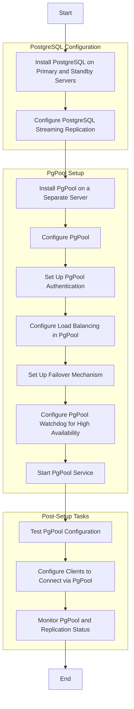
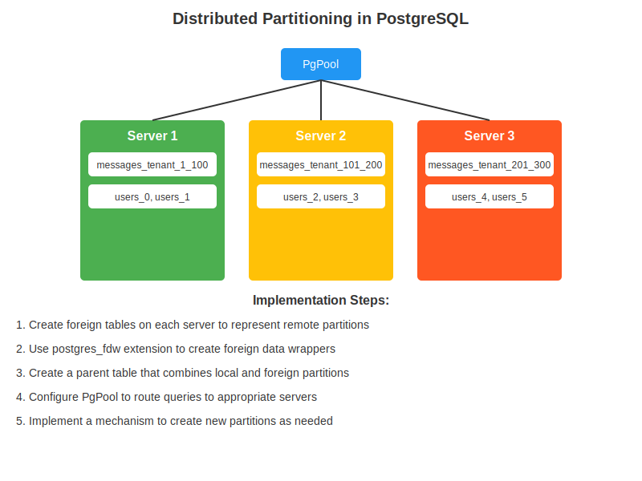

## Indexing

Here's an in-depth look at indexing in PostgreSQL:

**1. B-tree Indexes (Default)**

B-tree is the default index type in PostgreSQL and is suitable for most scenarios.
```sql
CREATE INDEX idx_user_email ON users(email);
```
**B-tree indexes are good for:**

- Equality and range queries
- Sorting operations
- Pattern matching with LIKE 'abc%' (prefix searches)


**2.Hash Indexes**

Hash indexes are good for equality comparisons only.
```sql
CREATE INDEX idx_user_id_hash ON users USING HASH (id);
```
Use hash indexes when you only need to check for equality and have sufficient memory.

**3. GiST (Generalized Search Tree) Indexes**

GiST indexes are useful for complex data types like geometric data or full-text search.
```sql 
CREATE INDEX idx_user_location ON users USING GIST (location);
```

**4. GIN (Generalized Inverted Index)**

GIN indexes are good for composite values where you need to search for element values.
```sql
CREATE INDEX idx_document_tags ON documents USING GIN (tags);
```
GIN is often used for full-text search and array operations.

**5. BRIN (Block Range INdex)**

BRIN indexes are good for very large tables where data has some natural correlation with physical storage order.
```sql
CREATE INDEX idx_log_timestamp ON log_entries USING BRIN (timestamp);
```
**6. Partial Indexes**

Partial indexes cover only a subset of a table's data.
```sql
CREATE INDEX idx_active_users ON users (email) WHERE status = 'active';
```

**7. Multicolumn Indexes**

You can create an index on multiple columns.
```sql 
CREATE INDEX idx_user_name_email ON users (last_name, first_name, email);
```
The order of columns in a multicolumn index is important. It's most effective when the leftmost columns are used in WHERE clauses.

**8. Expression Indexes**

You can create indexes on expressions or function results.
```sql 
CREATE INDEX idx_lower_email ON users (LOWER(email));
```
This allows efficient case-insensitive searches.
Best Practices and Considerations:

1. Don't over-index: Indexes speed up reads but slow down writes. Each index needs to be updated when the data changes.
2. Analyze query patterns: Use EXPLAIN ANALYZE to understand how your queries are executed and where indexes might help.
3. Regular maintenance: Use VACUUM and ANALYZE regularly to keep your indexes efficient.
4. Consider the workload: For read-heavy tables, more indexes might be beneficial. For write-heavy tables, fewer indexes might be better.
5. Monitor index usage: PostgreSQL provides system views like pg_stat_user_indexes to see which indexes are being used.
6. Unique indexes: Consider adding unique indexes for columns that should have unique values. This enforces data integrity and can improve query performance.

```sql
CREATE UNIQUE INDEX idx_user_email_unique ON users(email);
```

7. Covering indexes: Include all columns referenced in a query in the index to allow index-only scans.

```sql
CREATE INDEX idx_user_name_email_cover ON users(last_name, first_name) INCLUDE (email);
```

8. Functional indexes: For frequently used expressions, consider creating a functional index.

```sql
CREATE INDEX idx_user_name_lower ON users(LOWER(last_name || ' ' || first_name));
```

9. Concurrent index creation: For production databases, use CREATE INDEX CONCURRENTLY to avoid locking issues.

```sql
CREATE INDEX CONCURRENTLY idx_user_status ON users(status);
```

10. Index-only scans: Design your indexes to support index-only scans for frequently run queries to avoid table access.
11. Partial indexes for skewed data: If a column has skewed data distribution, consider partial indexes.
```sql
CREATE INDEX idx_orders_recent ON orders(order_date) WHERE order_date > CURRENT_DATE - INTERVAL '3 months';
```
Remember, the effectiveness of indexes can vary based on your specific data and query patterns. Always test thoroughly in an environment similar to production before implementing indexes in a live system.

### Denormalization
```sql
-- Payments table (denormalized with tenant info)
CREATE TABLE payments (
    payment_id SERIAL PRIMARY KEY,
    tenant_id INTEGER NOT NULL REFERENCES tenants(tenant_id),
    amount DECIMAL(10, 2) NOT NULL,
    payment_date TIMESTAMP DEFAULT CURRENT_TIMESTAMP,
    payment_method VARCHAR(50),
    status VARCHAR(20),
    tenant_name VARCHAR(100) NOT NULL,
    tenant_subdomain VARCHAR(63) NOT NULL,
    billing_email VARCHAR(255) NOT NULL
);

-- Invoices table (denormalized with tenant and payment info)
CREATE TABLE invoices (
    invoice_id SERIAL PRIMARY KEY,
    tenant_id INTEGER NOT NULL REFERENCES tenants(tenant_id),
    payment_id INTEGER REFERENCES payments(payment_id),
    invoice_number VARCHAR(50) UNIQUE NOT NULL,
    amount DECIMAL(10, 2) NOT NULL,
    issued_date TIMESTAMP DEFAULT CURRENT_TIMESTAMP,
    due_date TIMESTAMP,
    status VARCHAR(20),
    tenant_name VARCHAR(100) NOT NULL,
    tenant_subdomain VARCHAR(63) NOT NULL,
    billing_email VARCHAR(255) NOT NULL
);
```


# PgPool-II Replication Setup Summary



## Architecture
- 1 Primary PostgreSQL server
- 2 Standby PostgreSQL servers
- 1 PgPool-II server

## 1. Set up PostgreSQL Streaming Replication

### Primary Server (postgresql.conf)
```
wal_level = replica
max_wal_senders = 10
wal_keep_segments = 32
```

### Standby Servers (postgresql.conf)
```
hot_standby = on
```

### Create Replication User
```sql
CREATE ROLE repl_user LOGIN REPLICATION ENCRYPTED PASSWORD 'your_password';
```

### Configure pg_hba.conf on Primary
```
host replication repl_user 10.0.0.0/24 md5
```

### Set up recovery.conf on Standbys
```
standby_mode = 'on'
primary_conninfo = 'host=primary_ip port=5432 user=repl_user password=your_password'
trigger_file = '/path/to/trigger_file'
```

## 2. Install PgPool-II
```bash
sudo apt-get install pgpool2  # Example for Ubuntu
```

## 3. Configure PgPool-II (pgpool.conf)
```
listen_addresses = '*'
port = 9999
backend_hostname0 = 'primary_ip'
backend_port0 = 5432
backend_weight0 = 1
backend_hostname1 = 'standby1_ip'
backend_port1 = 5432
backend_weight1 = 1
backend_hostname2 = 'standby2_ip'
backend_port2 = 5432
backend_weight2 = 1
backend_flag0 = 'ALLOW_TO_FAILOVER'
backend_flag1 = 'ALLOW_TO_FAILOVER'
backend_flag2 = 'ALLOW_TO_FAILOVER'
load_balance_mode = on
master_slave_mode = on
master_slave_sub_mode = 'stream'
sr_check_period = 10
sr_check_user = 'repl_user'
sr_check_password = 'your_password'
health_check_period = 10
health_check_user = 'your_health_check_user'
health_check_password = 'your_health_check_password'
failover_command = '/path/to/failover_script'
```

## 4. Configure Client Authentication (pool_hba.conf)
```
host    all    all    10.0.0.0/24    md5
```

## 5. Start PgPool-II
```bash
pgpool -n &
```

## 6. Connect Clients
Clients should connect to PgPool's IP address and port (9999) instead of directly to PostgreSQL.

## Key Features
- Load Balancing: Distributes READ queries among all servers
- High Availability: Automatic failover if primary server fails
- Connection Pooling: Reduces connection overhead

## Considerations
- Implement proper security measures
- Regularly monitor replication lag
- Set up and test failover mechanism thoroughly
- Continue regular backups and monitoring


### Partitioning Single Database, Shared Schema
```sql
-- Assuming PostgreSQL 10 or later for declarative partitioning

-- Tenants table (not partitioned as it's typically small)
CREATE TABLE tenants (
    id SERIAL PRIMARY KEY,
    name VARCHAR(100) NOT NULL,
    subdomain VARCHAR(63) UNIQUE NOT NULL,
    created_at TIMESTAMP DEFAULT CURRENT_TIMESTAMP
);

-- Users table partitioned by tenant_id
CREATE TABLE users (
    id SERIAL,
    tenant_id INTEGER NOT NULL,
    username VARCHAR(50) NOT NULL,
    email VARCHAR(100) NOT NULL,
    password_hash VARCHAR(255) NOT NULL,
    created_at TIMESTAMP DEFAULT CURRENT_TIMESTAMP,
    last_login TIMESTAMP,
    PRIMARY KEY (tenant_id, id)
) PARTITION BY HASH (tenant_id);

-- Create partitions for users (example with 8 partitions)
CREATE TABLE users_0 PARTITION OF users FOR VALUES WITH (MODULUS 8, REMAINDER 0);
CREATE TABLE users_1 PARTITION OF users FOR VALUES WITH (MODULUS 8, REMAINDER 1);
-- ... create more partitions up to users_7

-- Messages table partitioned by tenant_id
CREATE TABLE messages (
    id SERIAL,
    tenant_id INTEGER NOT NULL,
    chat_id INTEGER NOT NULL,
    user_id INTEGER NOT NULL,
    content TEXT NOT NULL,
    created_at TIMESTAMP DEFAULT CURRENT_TIMESTAMP,
    PRIMARY KEY (tenant_id, id)
) PARTITION BY HASH (tenant_id);

-- Create partitions for messages (example with 8 partitions)
CREATE TABLE messages_0 PARTITION OF messages FOR VALUES WITH (MODULUS 8, REMAINDER 0);
CREATE TABLE messages_1 PARTITION OF messages FOR VALUES WITH (MODULUS 8, REMAINDER 1);
-- ... create more partitions up to messages_7

-- Chats table (similar partitioning strategy)
CREATE TABLE chats (
    id SERIAL,
    tenant_id INTEGER NOT NULL,
    name VARCHAR(100),
    created_at TIMESTAMP DEFAULT CURRENT_TIMESTAMP,
    created_by INTEGER NOT NULL,
    PRIMARY KEY (tenant_id, id)
) PARTITION BY HASH (tenant_id);

-- Create partitions for chats

-- Chat participants table (similar partitioning strategy)
CREATE TABLE chat_participants (
    id SERIAL,
    tenant_id INTEGER NOT NULL,
    chat_id INTEGER NOT NULL,
    user_id INTEGER NOT NULL,
    joined_at TIMESTAMP DEFAULT CURRENT_TIMESTAMP,
    PRIMARY KEY (tenant_id, id)
) PARTITION BY HASH (tenant_id);

-- Create partitions for chat_participants

-- Add foreign key constraints (note: these work differently with partitioned tables)
ALTER TABLE messages ADD CONSTRAINT fk_messages_tenant
    FOREIGN KEY (tenant_id) REFERENCES tenants(id);
ALTER TABLE messages ADD CONSTRAINT fk_messages_chat
    FOREIGN KEY (tenant_id, chat_id) REFERENCES chats(tenant_id, id);
ALTER TABLE messages ADD CONSTRAINT fk_messages_user
    FOREIGN KEY (tenant_id, user_id) REFERENCES users(tenant_id, id);

-- Repeat similar constraints for other tables

-- Indexes (create on each partition for better performance)
CREATE INDEX idx_users_tenant_username ON users_0 (tenant_id, username);
CREATE INDEX idx_users_tenant_email ON users_0 (tenant_id, email);
-- Repeat for other users partitions and other tables

-- Function to get the appropriate shard for a tenant
CREATE OR REPLACE FUNCTION get_shard_for_tenant(p_tenant_id INTEGER) 
RETURNS INTEGER AS $$
BEGIN
    -- Simple hash function, adjust based on your sharding strategy
    RETURN p_tenant_id % 8;
END;
$$ LANGUAGE plpgsql;

-- View to simplify cross-shard querying (example for users)
CREATE OR REPLACE VIEW all_users AS
    SELECT * FROM users_0
    UNION ALL
    SELECT * FROM users_1
    -- ... include all partitions
;

-- Example of a sharding-aware function
CREATE OR REPLACE FUNCTION get_user_by_id(p_tenant_id INTEGER, p_user_id INTEGER)
RETURNS SETOF users AS $$
DECLARE
    shard_number INTEGER;
BEGIN
    shard_number := get_shard_for_tenant(p_tenant_id);
    RETURN QUERY EXECUTE format('SELECT * FROM users_%s WHERE tenant_id = $1 AND id = $2', shard_number)
    USING p_tenant_id, p_user_id;
END;
$$ LANGUAGE plpgsql;
```

# Distributed Partitioning Example for Multi-Tenant Chat App

This guide demonstrates how to implement distributed partitioning in a PostgreSQL-based multi-tenant chat application.

## Architecture Overview

- 3 PostgreSQL servers
- PgPool for query routing
- Partitioning by tenant_id and date



## 1. Server Setup

### Server 1 (Tenants 1-100)

```sql
CREATE TABLE messages_tenant_1_100 (
    message_id SERIAL,
    tenant_id INTEGER NOT NULL,
    user_id INTEGER NOT NULL,
    content TEXT NOT NULL,
    created_at TIMESTAMP DEFAULT CURRENT_TIMESTAMP,
    PRIMARY KEY (tenant_id, created_at, message_id)
) PARTITION BY RANGE (created_at);

CREATE TABLE messages_tenant_1_100_202301 PARTITION OF messages_tenant_1_100
    FOR VALUES FROM ('2023-01-01') TO ('2023-02-01');

CREATE TABLE messages_tenant_1_100_202302 PARTITION OF messages_tenant_1_100
    FOR VALUES FROM ('2023-02-01') TO ('2023-03-01');

-- Create more time-based partitions as needed

CREATE TABLE users_0 (
    user_id SERIAL,
    tenant_id INTEGER NOT NULL,
    username VARCHAR(50) NOT NULL,
    email VARCHAR(100) NOT NULL,
    created_at TIMESTAMP DEFAULT CURRENT_TIMESTAMP,
    PRIMARY KEY (tenant_id, user_id)
);

CREATE TABLE users_1 (
    -- Same structure as users_0
);
```

### Server 2 (Tenants 101-200)

```sql
CREATE TABLE messages_tenant_101_200 (
    -- Same structure as messages_tenant_1_100
) PARTITION BY RANGE (created_at);

CREATE TABLE messages_tenant_101_200_202301 PARTITION OF messages_tenant_101_200
    FOR VALUES FROM ('2023-01-01') TO ('2023-02-01');

-- Create more partitions as needed

CREATE TABLE users_2 (
    -- Same structure as users_0
);

CREATE TABLE users_3 (
    -- Same structure as users_0
);
```

### Server 3 (Tenants 201-300)

```sql
CREATE TABLE messages_tenant_201_300 (
    -- Same structure as messages_tenant_1_100
) PARTITION BY RANGE (created_at);

CREATE TABLE messages_tenant_201_300_202301 PARTITION OF messages_tenant_201_300
    FOR VALUES FROM ('2023-01-01') TO ('2023-02-01');

-- Create more partitions as needed

CREATE TABLE users_4 (
    -- Same structure as users_0
);

CREATE TABLE users_5 (
    -- Same structure as users_0
);
```

## 2. Set Up Foreign Data Wrappers

Execute on all servers to enable cross-server queries:

```sql
CREATE EXTENSION postgres_fdw;

-- On Server 1
CREATE SERVER server2 FOREIGN DATA WRAPPER postgres_fdw
    OPTIONS (host 'server2_ip', port '5432', dbname 'chatapp');

CREATE SERVER server3 FOREIGN DATA WRAPPER postgres_fdw
    OPTIONS (host 'server3_ip', port '5432', dbname 'chatapp');

CREATE USER MAPPING FOR CURRENT_USER SERVER server2
    OPTIONS (user 'username', password 'password');

CREATE USER MAPPING FOR CURRENT_USER SERVER server3
    OPTIONS (user 'username', password 'password');

-- Create foreign tables for remote partitions
CREATE FOREIGN TABLE messages_tenant_101_200 (
    -- Same structure as local messages table
)
SERVER server2;

CREATE FOREIGN TABLE messages_tenant_201_300 (
    -- Same structure as local messages table
)
SERVER server3;

-- Repeat similar commands on Server 2 and Server 3
```

## 3. Create Parent Tables

On each server, create a parent table that includes both local and foreign partitions:

```sql
CREATE TABLE messages (
    message_id SERIAL,
    tenant_id INTEGER NOT NULL,
    user_id INTEGER NOT NULL,
    content TEXT NOT NULL,
    created_at TIMESTAMP DEFAULT CURRENT_TIMESTAMP,
    PRIMARY KEY (tenant_id, created_at, message_id)
) PARTITION BY RANGE (tenant_id);

-- On Server 1
ALTER TABLE messages ATTACH PARTITION messages_tenant_1_100
    FOR VALUES FROM (1) TO (101);
ALTER TABLE messages ATTACH PARTITION messages_tenant_101_200
    FOR VALUES FROM (101) TO (201);
ALTER TABLE messages ATTACH PARTITION messages_tenant_201_300
    FOR VALUES FROM (201) TO (301);

-- Similar commands on Server 2 and Server 3, adjusting for local partitions
```

## 4. Configure PgPool

Edit pgpool.conf:

```
backend_hostname0 = 'server1_ip'
backend_port0 = 5432
backend_weight0 = 1
backend_hostname1 = 'server2_ip'
backend_port1 = 5432
backend_weight1 = 1
backend_hostname2 = 'server3_ip'
backend_port2 = 5432
backend_weight2 = 1

load_balance_mode = on
select_function = 'SELECT node_id FROM select_node_for_tenant($1)'
```

Create the routing function in PgPool:

```sql
CREATE FUNCTION select_node_for_tenant(IN tenant_id INTEGER, OUT node_id INTEGER) AS $$
BEGIN
    IF tenant_id BETWEEN 1 AND 100 THEN
        node_id := 0;  -- Server 1
    ELSIF tenant_id BETWEEN 101 AND 200 THEN
        node_id := 1;  -- Server 2
    ELSIF tenant_id BETWEEN 201 AND 300 THEN
        node_id := 2;  -- Server 3
    ELSE
        RAISE EXCEPTION 'No node found for tenant_id: %', tenant_id;
    END IF;
END;
$$ LANGUAGE plpgsql;
```

## 5. Usage Examples

### Insert a message

```sql
INSERT INTO messages (tenant_id, user_id, content)
VALUES (150, 1001, 'Hello, World!');
```

PgPool will route this to Server 2 based on the tenant_id.

### Query messages for a specific tenant

```sql
SELECT * FROM messages
WHERE tenant_id = 150 AND created_at >= '2023-01-01'
ORDER BY created_at DESC
LIMIT 100;
```

This query will be routed to Server 2 and use the appropriate time-based partition.

### Cross-partition query (less efficient, avoid if possible)

```sql
SELECT COUNT(*) FROM messages
WHERE created_at >= '2023-01-01';
```

This query will need to aggregate results from all servers.

## 6. Maintenance Tasks

### Adding a new time-based partition

Execute on all servers:

```sql
-- For messages_tenant_1_100 on Server 1
CREATE TABLE messages_tenant_1_100_202304 PARTITION OF messages_tenant_1_100
    FOR VALUES FROM ('2023-04-01') TO ('2023-05-01');

-- Similar commands for other tenant ranges on respective servers
```

### Monitoring partition usage

```sql
SELECT schemaname, relname, n_live_tup
FROM pg_stat_user_tables
WHERE relname LIKE 'messages_tenant_%'
ORDER BY n_live_tup DESC;
```

### Backup strategy

Use pg_dump with --table option to backup specific partitions:

```bash
pg_dump -h server1_ip -U username -d chatapp --table=messages_tenant_1_100* > server1_backup.sql
```

## Conclusion

This distributed partitioning setup allows for horizontal scaling of the chat application. It improves query performance and data manageability but increases complexity. Regular monitoring and maintenance are crucial for optimal performance.
